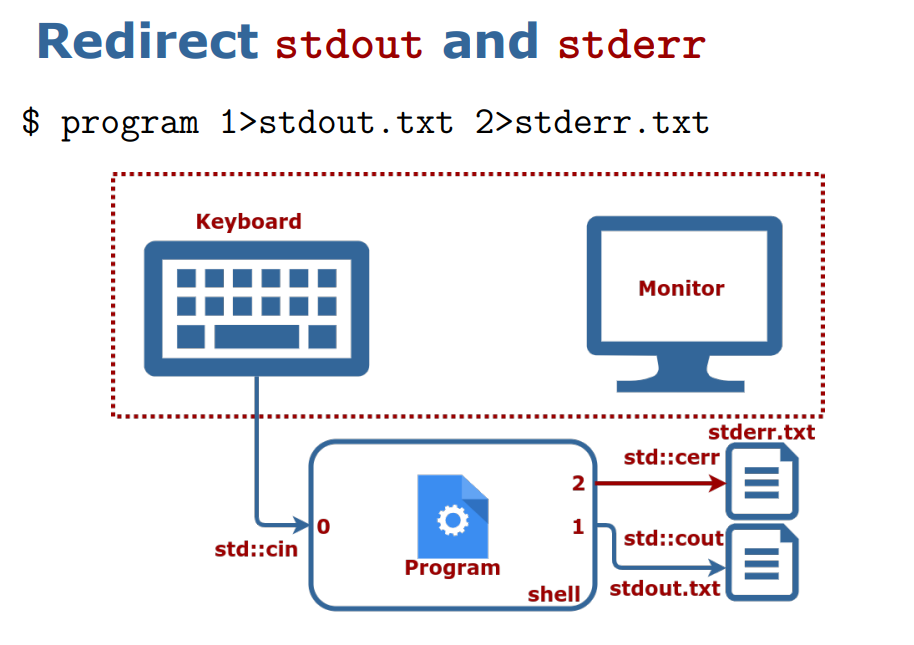
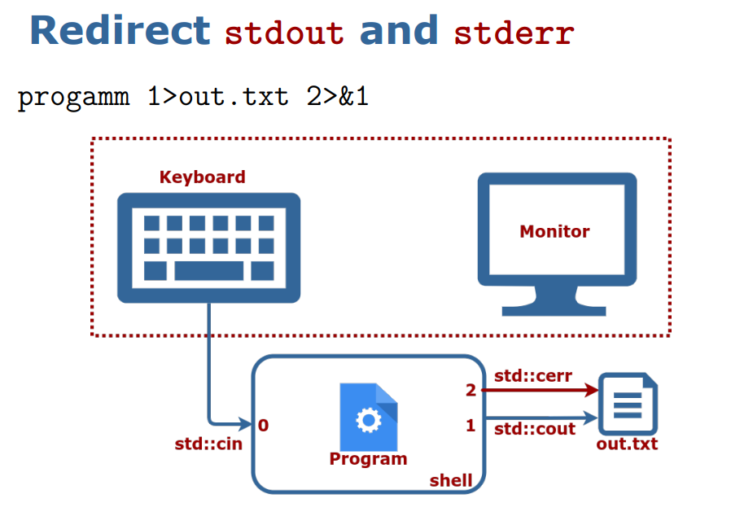
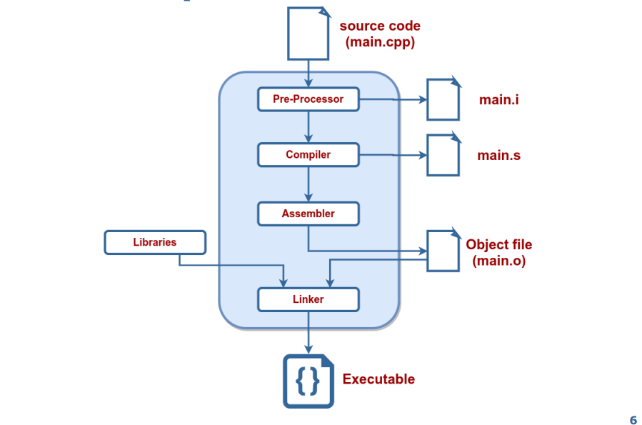

# C++, CV and CMake

res : [[code](./code/)] &  /[cpp ref](./cp/) | [[doc](./doc/)] | my OpenCV [NOTES](./opencv.MD)

 

```cpp

1       #include <iostream>
2
3       int main () {
4       // cpp 🌸
5       std :: cout << "Hello World!" << std :: endl;
6       return 0;
7       }

```

`$ c++ file.cpp` > `$ ./a.out` > `$ ./a.out l> stdout.txt`.  Use `clang_format` to format your code


`main()` is a function that returns an error code
+ Error code 0 means OK
+ Error code can be any number in [1, 255]

```cpp

1       int main () {
2       return 0; // Program finished without errors.
3       }


1       int main () {
2       return 1; // Program finished with error code 1.
3       }


```

`#include <file>` — system include files ; `#include "file"` — local include files

+ std::cin — maps to stdin ; std::cout — maps to stdout ; std::cerr — maps to stderr

Compilation is translation from text to machine code. Two compilers : { Clang, gcc }

```bash

        $ c++ -std=c++11 -o hello_world hello_world .cpp
        $ ./ hello_world

```

 

+ Preprocess : `$ clang++ -E main.cpp > main.i`
+ Compilation : `$ clang++ -S main.i`
+ Assembly : `$ clang++ -c main.s`
+ Linking : `$ clang++ main.o -o main`

Compilation flags : `-std=c++17,`, `-Wall`, `-Wextra`, `-Werror` | Optimization options:
`-O0` — no optimizations [default]
`-O3` or `-Ofast` — full optimizations. Keep debugging symbols: `-g`.


Tools: [GNU/Linux]() { filesystem, terminal, standard input/output } ; [Text Editor]() { configuring, terminal, compile, debug } ; [Build Systems]() { headers/sources, libraries, compilation flags, cmake, 3rd paty libraries } ; [Git]() ; [gdb]() ; [Web-based tools]() { Quick Bench, Compiler  Explorer, cpp insights, cppreference.com } ; [Clang-tools](https://apt.llvm.org/) {Clang-format, Clang-tidy, Clangd, Cppcheck} ; [Google test](), [OpenCV](). Install llvm-toolchain from [here](https://apt.llvm.org/).


Install - git : `$ sudo apt install git`, build tools : ` $ sudo apt install build-essential`, cmake : ` $ sudo apt install cmake`, cppcheck : ` $ sudo apt install cppcheck`, clang-tools ` $ sudo apt install clang-format clang-tidy clangd`.

```bash
        $ sudo apt update
        $ sudo apt install git build-essential cmake cppcheck clang-format clang-tidy clangd
```

In VS Code for c++ extensions : CTRL + P , then execute `ext install ms-vscode.cpptools` and `ext install llvm-vs-code-extensions.vscode-clangd`; for CMake extensions : `ext install twxs.cmake`, `ext install ms-vscode.cmake-tools` and `ext install cheshirekow.cmake-format`; for markdown extensions `ext install yzhang.markdown-all-in-one` and `ext install DavidAnson.vscode-markdownlint`.

CODE:

Core c++ : [c++ basic syntax](), [the "main" function](), [#include statements](), [variables](), [control structures (if, for , while) ](), [I/O streams](), [Input parameters](), [Built-in types](), [Operators](), [Scopes](), [Functions](), [c++ strings](), [Pass by value / Pass by reference](), [Namespaces](), [Containers](), [std::tuple](), [Iterators](), [try/ catch](), [enum classes](), [STL library](), [STL algorithms](), [Function Overloading](), [Operator Overloading](), [String streams](), [filesystem]()

Modern c++ :  [Classes](), [Const Correctness](), [typedef / using](), [static variables / methods](), [Move semantics](), [Special functions](), [Singleton pattern](), [Inheritence](), [Function Overriding](), [Abstract classes](), [Interfaces](), [Strategy Pattern](), [Polymorphism](), [Typecasting](), [Memory Management](), [Stack vs Heap](), [Pointers](), [new / delete](), [this pointer](), [Memory issues](), [RAII](), [Smart pointers](), [Generic programming](), [Template functions](), [Template classes](), [Static code generation](), [lambdas]().

## C++ Build System: CMake

Library: multiple object files that are logically connected. Types of libraries:
- Static: faster, take a lot of space, become part
of the end binary, named: `lib*.a`
- Dynamic: slower, can be copied, referenced by a
program, named `lib*.so` .

Create a static library with
` $ ar rcs libname.a module.o module.o …`.  Static libraries are just archives just like `zip/tar/…`.

Header / Source Separation :
Move all declarations to header files (`*.hpp`) and Implementation goes to `*.cpp` or `*.cc`.

```cpp
1       // some_file.hpp
2       Type SomeFunc (... args ...);
3
4       // some_file.cpp
5       #include "some_file.hpp"
6       Type SomeFunc (... args ...) {} // implementation
7
8       // program.cpp
9       #include "some_file.hpp"
10      int main () {
11      SomeFunc(/* args */);
12      return 0;
13      }
```

To use a library we need:
1. A header file `library_api.h`
2. The compiled library object `libmylibrary.a`
   
         folder/
         --- tools.hpp
         --- tools.cpp
         --- main.cpp


<table style="width:100%" >
<tr>
<th>tools.hpp</th>
<th>tools.cpp</th>
<th>main.cpp</th>
</tr>

<tr>
<td>

```cpp

#pragma once // Ensure file is included only once
void MakeItSunny ();
void MakeItRain ();

```
</td>
<td>

```cpp

#include "tools.hpp"
#include <iostream >
void MakeItRain () {
// important weather manipulation code
std :: cout << "Here! Now it rains! Happy?\n";
}
void MakeItSunny () { std :: cerr << "Not available\n"; }
```

</td>
<td>

```cpp

#include "tools.hpp"
int main () {
MakeItRain ();
MakeItSunny ();
return 0;
}
```
</td>
</tr>
</table>

Compile modules: ` $ c++ -std=c++17 -c tools.cpp -o tools.o`

Organize modules into libraries: ` $ ar rcs libtools.a tools.o`

Link libraries when building code: ` $ c++ -std=c++17 main.cpp -L . -ltools -o main`

Run the code: ` $ ./main`

### CMake : Does not build the code, generates files to feed into a build system

Build process : ` $ cd <project_folder>` > ` $ . mkdir build ` > ` $ cd build ` > ` $ cmake .. ` > ` $ make `.

The build process is completely defined in `CMakeLists.txt` and childrens `src/CMakeLists.txt`, etc. 

<b>CMakeLists.txt</b>:

```cmake
        cmake_minimum_required(VERSION 3.1) # Mandatory.
        project( first_project ) # Mandatory.
        set( CMAKE_CXX_STANDARD 17) # Use c++17.

        # tell cmake where to look for *.hpp, *.h files
        include_directories(include /)

        # create library "libtools"
        add_library(tools src/tools.cpp) # creates libtools.a

        # add executable main
        add_executable(main src/tools_main.cpp) # main.o

        # tell the linker to bind these objects together
        target_link_libraries(main tools) # ./main

```

Automatically detects changes and after doing changes: ` $ . cd <project_folder>/build` and ` $ make`.


<table style="width:100%" >
<tr>
<th>project structure:</th>
<th>CMake compilation options</th>
</tr>

<tr>
<td>


```cmake

 |-- project_name /
 | |-- CMakeLists .txt
 | |-- build/ # All generated build files
 | |-- results/ # Executable artifacts
 | | |-- bin/
 | | |-- tools_demo
 | | |-- lib/
 | | |-- libtools.a
 | |-- include/ # API of the project
 | | |-- project_name
 | | |-- library_api .hpp
 | |-- src/
 | | |-- CMakeLists .txt
 | | |-- project_name
 | | |-- CMakeLists .txt
 | | |-- tools.hpp
 | | |-- tools.cpp
 | | |-- tools_demo .cpp
 | |-- tests/ # Tests for your code
 | | |-- test_tools .cpp
 | | |-- CMakeLists .txt
 | |-- README.md # How to use your code

```

</td>
<td>

```cmake

 set( CMAKE_CXX_STANDARD 17)

 # Set build type if not set.
 if(NOT CMAKE_BUILD_TYPE )
 set( CMAKE_BUILD_TYPE Debug)
 endif ()
 # Set additional flags.
 set( CMAKE_CXX_FLAGS "-Wall -Wextra ")
 set( CMAKE_CXX_FLAGS_DEBUG "-g -O0")


```

`-Wall` `-Wextra`: show all warnings; `-g`: keep debug information in binary; `-O<num>`: optimization level in {0, 1, 2, 3} where 0: no optimization and 3: full optimization.

Useful commands in CMake: Set variables with `set(VAR VALUE)`, Get value of a variable with `${VAR}`, Show a message `message(STATUS "message")`, Also possible `WARNING`, `FATAL_ERROR`.

In ` $ make -j2` # pass your number of cores here and ` $ make clean` to remove generated binaries`.

</td>
</tr>

</table>

Use pre-compiled library:  `find_package` calls multiple `find_path` and `find_library` functions. To use `find_package(<pkg>)` CMake must
have a file `Find<pkg>.cmake` in `CMAKE_MODULE_PATH` folders. `Find<pkg>.cmake` defines which libraries and headers belong to package `<pkg>`.


<table style="width:100%" >
<tr>
<th>CMakeLists.txt</th>
<th>cmake_modules/Findsome_pkg.cmake</th>
</tr>

<tr>
<td>


```cmake

 cmake_minimum_required(VERSION 3.1)
 project( first_project )

 # CMake will search here for Find <pkg >.cmake files
 SET( CMAKE_MODULE_PATH
 ${PROJECT_SOURCE_DIR}/ cmake_modules )

 # Search for Findsome_pkg.cmake file and load it
 find_package(some_pkg )

 # Add the include folders from some_pkg
 include_directories(${some_pkg_INCLUDE_DIRS})

 # Add the executable "main"
 add_executable(main small_main .cpp)
 # Tell the linker to bind these binary objects
 target_link_libraries(main ${some_pkg_LIBRARIES})


```

</td>
<td>

```cmake

# Find the headers that we will need
find_path( some_pkg_INCLUDE_DIRS include/some_lib.hpp < FOLDER_WHERE_TO_SEARCH >)
message(STATUS "headers: ${some_pkg_INCLUDE_DIRS}")

# Find the corresponding libraries
find_library( some_pkg_LIBRARIES
NAMES some_lib_name
PATHS <FOLDER_WHERE_TO_SEARCH >)
message(STATUS "libs: ${some_pkg_LIBRARIES}")
```
</td>
</tr>

</table>


resources: [mathematical optimizations with google or-tool](https://developers.google.com/optimization/introduction/cpp), [SNOPT](https://ccom.ucsd.edu/~optimizers/solvers/snopt/), [IPOPT](https://github.com/coin-or/Ipopt), [Conic Bundle](https://www-user.tu-chemnitz.de/~helmberg/ConicBundle/Manual/index.html), [Computer Vision and OpenCV in c++](https://www.youtube.com/watch?v=uJrwLq_BKPY&list=PLkmvobsnE0GHMmTF7GTzJnCISue1L9fJn), [Computer Vision Projects - C++](https://www.youtube.com/watch?v=9iEPzbG-xLE&list=PLMoSUbG1Q_r8jFS04rot-3NzidnV54Z2q), [Modern c++](https://www.youtube.com/watch?v=sZK6ouwREXA&list=PLgnQpQtFTOGRM59sr3nSL8BmeMZR9GCIA), [google code styling guide - c++](https://google.github.io/styleguide/cppguide.html), [The C++ Programming Language (4th Edition)](https://www.stroustrup.com/4th.html), [cppreference](https://en.cppreference.com/w/cpp), [cpp tutorial](https://cplusplus.com/doc/tutorial/), [cpp core guidelines](https://github.com/isocpp/CppCoreGuidelines).