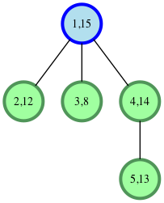
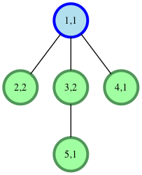
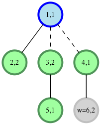

# balanced-forest

Greg has a tree of nodes containing integer data. He wants to insert a node with some non-zero integer value somewhere into the tree. His goal is to be able to cut two edges and have the values of each of the three new trees sum to the same amount. This is called a balanced forest. Being frugal, the data value he inserts should be minimal. Determine the minimal amount that a new node can have to allow creation of a balanced forest. If it's not possible to create a balanced forest, return -1.

For example, you are given node values c = [15, 12, 8, 14, 13] and edges = [[1, 2], [1, 3], [1, 4], [4, 5]]. It is the following tree:



The blue node is root, the first number in a node is node number and the second is its value. Cuts can be made between nodes 1 and 3 and nodes 1 and 4 to have three trees with sums 27, 27 and 8. Adding a new node w of c[w]=19 to the third tree completes the solution.

`Function Description` : 

Complete the balancedForest function in the editor below. It must return an integer representing the minimum value of c[w] that can be added to allow creation of a balanced forest, or -1 if it is not possible.

balancedForest has the following parameter(s):

+ c: an array of integers, the data values for each node
+ edges: an array of 2 element arrays, the node pairs per edge

`Input Format` :

The first line contains a single integer, q, the number of queries.

Each of the following q sets of lines is as follows:

+ The first line contains an integer, n, the number of nodes in the tree.
+ The second line contains n space-separated integers describing the respective values of c[1], c[2],...,c[n] where each c[i] denotes the value at node i.
+ Each of the following n-1 lines contains two space-separated integers, x[j] and y[j], describing edge j connecting nodes x[j] and y[j].

`Constraints` :

$$ 1 \le q \le 5 $$
$$ 1 \le n \le 5 * 10^4 $$
$$ 1 \le c[i] \le 10^9 $$

Each query forms a valid undirected tree.

`Subtasks` :

For 30% of the maximum score:

$$ 1 \le n \le 100 $$
$$ 1 \le c[i] \le 100 $$

For 50% of the maximum score:

$$ 1 \le n \le 2000 $$
$$ 1 \le c[i] \le 10^9 $$

`Output Format` :

For each query, return the minimum value of the integer c[w]. If no such value exists, return -1 instead.

<table width=100%>
<tr>
<th>Sample Input :</th>
<th>Sample Output :</th>
</tr>

<tr>
<td>

```
2
5
1 2 2 1 1
1 2
1 3
3 5
1 4
3
1 3 5
1 3
1 2
```
</td>

<td>

```
2
-1
```
</td>
</tr>
</table>

`Explanation` :

We perform the following two queries:

+ The tree initially looks like this:
  


Greg can add a new node w=6 with c[w]=2 and create a new edge connecting nodes 4 and 6. Then he cuts the edge connecting nodes 1 and 4 and the edge connecting nodes 1 and 3. We now have a three-tree balanced forest where each tree has a sum of 3.

In the second query, it's impossible to add a node in such a way that we can split the tree into a three-tree balanced forest so we return -1.
