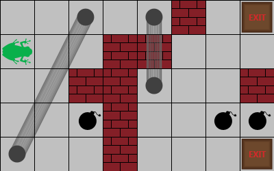
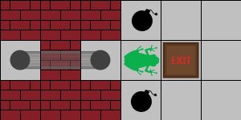

# frog-in-maze

Alef the Frog is in an n * m two-dimensional maze represented as a table. The maze has the following characteristics:

+ Each cell can be free or can contain an obstacle, an exit, or a mine.
+ Any two cells in the table considered adjacent if they share a side.
+ The maze is surrounded by a solid wall made of obstacles.
+ Some pairs of free cells are connected by a bidirectional tunnel.




When Alef is in any cell, he can randomly and with equal probability choose to move into one of the adjacent cells that don't contain an obstacle in it. If this cell contains a mine, the mine explodes and Alef dies. If this cell contains an exit, then Alef escapes the maze.

When Alef lands on a cell with an entrance to a tunnel, he is immediately transported through the tunnel and is thrown into the cell at the other end of the tunnel. Thereafter, he won't fall again, and will now randomly move to one of the adjacent cells again. (He could possibly fall in the same tunnel later.)

It's possible for Alef to get stuck in the maze in the case when the cell in which he was thrown into from a tunnel is surrounded by obstacles on all sides.

Your task is to write a program which calculates and prints a probability that Alef escapes the maze.

`Input Format` :

The first line contains three space-separated integers n, m and k denoting the dimensions of the maze and the number of bidirectional tunnels.

The next n lines describe the maze. The i'th line contains a string of length m denoting the i'th row of the maze. The meaning of each character is as follows:

+ \# denotes an obstacle.
+ A denotes a free cell where Alef is initially in.
+ \* denotes a cell with a mine.
+ % denotes a cell with an exit.
+ O denotes a free cell (which may contain an entrance to a tunnel).

The next k lines describe the tunnels. The i'th line contains four space-separated integers i_1, j_1, i_2, j_2. Here, (i_1, j_1) and (i_2, j_2)  denote the coordinates of both entrances of the tunnel. (i, j) denotes the row and column number, respectively.

`Constraints` :

+ 1 ≤ n, m ≤ 20
+ 0 ≤ 2+k ≤ n+m
+ 1 ≤ i_1, i_2 ≤ n
+ 1 ≤ j_1, j_2 ≤ m
+ (i_1, j_1) and (i_2, j_2) are distinct
+ A appears exactly once.
+ Each free cell contains at most one entrance to a tunnel.
+ If a cell contains an entrance to a tunnel, then it doesn't contain an obstacle, mine or exit, and Alef doesn't initially stand in it.
+ Tunnels don't connect adjacent cells.

`Output Format` :

Print one real number denoting the probability that Alef escapes the maze. Your answer will be considered to be correct if its (absolute) difference from the true answer is not greater than 10^{-6}.


<table width=100%>
<tr>
<th>Sample Input 0:</th>
<th>Sample Output 0:</th>
</tr>

<tr>
<td>

```
3 6 1
###*OO
O#OA%O
###*OO
2 3 2 1
```
</td>

<td>

```
0.25
```
</td>
</tr>
</table>

Explanation 0 :

The following depicts this sample case:



In this case, Alef will randomly choose one of four adjacent cells. If he goes up or down, he will explode and die. If he goes right, he will escape. If he goes left, he will go through a tunnel and get stuck in cell (2, 1). So the probability of Alef escaping is 1/4.

### `Solution` :

To solve the "Frog in Maze" problem optimally, we need to understand and calculate the probability of Alef the Frog escaping the maze starting from a specific cell. Here's a detailed explanation and steps to approach this problem:

`Problem Breakdown` :

+ Maze Representation: The maze is an `n x m` grid where each cell can be:
    + `#`: Obstacle
    + `A`: Starting position of Alef
    + `*`: Mine (Alef dies if he steps on this)
    + `%`: Exit (Alef escapes if he steps on this)
    + `O`: Free cell (might contain an entrance to a tunnel)

+ Movement and Tunnels:
    + Alef moves randomly to one of the adjacent cells (up, down, left, right) if they are not obstacles.
    + If Alef steps on a cell with a tunnel entrance, he is transported to the corresponding tunnel exit and continues moving from there.
    + Alef can get stuck if a tunnel exit leads to a cell surrounded by obstacles.
Objective:

+ Calculate the probability that Alef escapes the maze.

### Approach : 
#### `Representation of Maze`:

+ The maze is represented as a 2D grid with characters denoting different types of cells: free cell, obstacle, mine, exit, and tunnel entrance.
+ Tunnels are represented by pairs of cells where each entrance has a corresponding exit.

#### `Building Transition Matrix`:

+ The problem is approached using Markov chain principles. The transition matrix represents the probabilities of moving from one cell to another.
+ For each free cell in the maze, calculate the probabilities of moving to its adjacent cells (excluding obstacles) or tunnel exits.
+ Initialize an identity matrix for Gaussian elimination.

#### `Gaussian Elimination`:

+ Gaussian elimination is used to solve the system of linear equations represented by the transition matrix.
The goal is to find the probabilities of reaching an exit from each cell.
+ The matrix is manipulated to bring it to row-echelon form, simplifying the process of finding the solution.

#### `Back-Substitution`:

+ Once the matrix is in row-echelon form, back-substitution is performed to find the solution.
+ The probabilities of escaping from each cell are computed, with special attention given to the starting cell.

#### `Output`:

The probability of escaping from the starting cell (Alef's initial position) is printed as the final result.

```cpp
#include <bits/stdc++.h>

using namespace std;

const double EPSILON = 1e-10;
const int MAX_CELLS = 777;

char maze[MAX_CELLS][MAX_CELLS];
double matrix[MAX_CELLS][MAX_CELLS];
double solution[MAX_CELLS];
int variable[MAX_CELLS];
pair<int, int> tunnels[MAX_CELLS][MAX_CELLS];

int main() {
    int height, width, numTunnels;
    scanf("%d %d %d", &height, &width, &numTunnels);

    // Read the maze
    for (int i = 0; i < height; ++i) {
        scanf("%s", maze[i]);
    }

    // Initialize tunnels
    for (int i = 0; i < height; ++i) {
        for (int j = 0; j < width; ++j) {
            tunnels[i][j] = {i, j};
        }
    }

    // Read tunnel connections
    for (int i = 0; i < numTunnels; ++i) {
        int r1, c1, r2, c2;
        scanf("%d %d %d %d", &r1, &c1, &r2, &c2);
        r1--; c1--; r2--; c2--;
        tunnels[r1][c1] = {r2, c2};
        tunnels[r2][c2] = {r1, c1};
    }

    // Initialize identity matrix
    for (int i = 0; i < height * width; ++i) {
        matrix[i][i] = 1.0;
    }

    int start = -1;

    // Build the matrix for Gaussian elimination
    for (int i = 0; i < height; ++i) {
        for (int j = 0; j < width; ++j) {
            if (maze[i][j] == '#' || maze[i][j] == '*') continue;

            int currentCell = i * width + j;
            if (maze[i][j] == 'A') {
                start = currentCell;
            } 
            if (maze[i][j] == '%') {
                matrix[currentCell][height * width] = 1.0;
                continue;
            }

            vector<pair<int, int>> neighbors;
            for (int dx = -1; dx <= 1; ++dx) {
                for (int dy = -1; dy <= 1; ++dy) {
                    if (abs(dx) + abs(dy) == 1) {
                        int ni = i + dx, nj = j + dy;
                        if (ni >= 0 && nj >= 0 && ni < height && nj < width && maze[ni][nj] != '#') {
                            neighbors.push_back(tunnels[ni][nj]);
                        }
                    }
                }
            }

            if (!neighbors.empty()) {
                double probability = 1.0 / neighbors.size();
                for (auto [ni, nj] : neighbors) {
                    int neighborCell = ni * width + nj;
                    matrix[currentCell][neighborCell] -= probability;
                }
            }
        }
    }

    int numCells = height * width;
    int column = 0;

    // Gaussian elimination
    for (int row = 0; row < numCells; ++row) {
        variable[row] = -1;
        while (column < numCells) {
            int pivotRow = row;
            for (int i = row; i < numCells; ++i) {
                if (fabs(matrix[i][column]) > fabs(matrix[pivotRow][column])) {
                    pivotRow = i;
                }
            }
            if (fabs(matrix[pivotRow][column]) < EPSILON) {
                column++;
                continue;
            }
            swap(matrix[row], matrix[pivotRow]);
            for (int i = row + 1; i < numCells; ++i) {
                double coeff = matrix[i][column] / matrix[row][column];
                for (int j = column; j <= numCells; ++j) {
                    matrix[i][j] -= coeff * matrix[row][j];
                }
            }
            variable[row] = column;
            break;
        }
    }

    // Back-substitution
    for (int row = numCells - 1; row >= 0; --row) {
        int col = variable[row];
        if (col == -1) continue;
        solution[col] = matrix[row][numCells] / matrix[row][col];
        for (int i = row - 1; i >= 0; --i) {
            matrix[i][numCells] -= matrix[i][col] * solution[col];
            matrix[i][col] = 0;
        }
    }

    printf("%.17f\n", solution[start]);

    return 0;
}
```

The problem involves determining the probability that a frog starting in a specific cell ('A') will escape a maze. The maze has walls ('#'), mines ('*'), exits ('%'), and tunnels connecting specific pairs of cells. The frog can move randomly to any adjacent cell unless blocked by a wall.

`Step-by-Step Explanation` :

+ Header Inclusions and Constants:
```cpp
#include <bits/stdc++.h>
using namespace std;

const double EPSILON = 1e-10;
const int MAX_CELLS = 777;
```
We include necessary headers and define constants. `EPSILON` is used for floating-point comparison, and `MAX_CELLS` defines the maximum size of the matrix for Gaussian elimination.

+ Global Variables :

```cpp
char maze[MAX_CELLS][MAX_CELLS];
double matrix[MAX_CELLS][MAX_CELLS];
double solution[MAX_CELLS];
int variable[MAX_CELLS];
pair<int, int> tunnels[MAX_CELLS][MAX_CELLS];
```
These variables store the maze, the matrix for Gaussian elimination, the solution array, variable indices, and tunnel connections.

+ Main Function :

```cpp
int main() {
    int height, width, numTunnels;
    scanf("%d %d %d", &height, &width, &numTunnels);
```
We start by reading the dimensions of the maze and the number of tunnels.

+ Reading the Maze :

```cpp
    for (int i = 0; i < height; ++i) {
        scanf("%s", maze[i]);
    }
```
We read the maze row by row.

+ Initializing Tunnels :
```cpp
    for (int i = 0; i < height; ++i) {
        for (int j = 0; j < width; ++j) {
            tunnels[i][j] = {i, j};
        }
    }
```
Each cell is initially set to point to itself, indicating no tunnel by default.

+ Reading Tunnel Connections :

```cpp
    for (int i = 0; i < numTunnels; ++i) {
        int r1, c1, r2, c2;
        scanf("%d %d %d %d", &r1, &c1, &r2, &c2);
        r1--; c1--; r2--; c2--;
        tunnels[r1][c1] = {r2, c2};
        tunnels[r2][c2] = {r1, c1};
    }
```
We read tunnel connections and update the tunnel mappings.

+ Initialize Identity Matrix :
  
```cpp
    for (int i = 0; i < height * width; ++i) {
        matrix[i][i] = 1.0;
    }
```
We initialize an identity matrix for the system of linear equations.

+ Building the Matrix :
  
```cpp
    int start = -1;
    for (int i = 0; i < height; ++i) {
        for (int j = 0; j < width; ++j) {
            if (maze[i][j] == '#' || maze[i][j] == '*') continue;

            int currentCell = i * width + j;
            if (maze[i][j] == 'A') {
                start = currentCell;
            }
            if (maze[i][j] == '%') {
                matrix[currentCell][height * width] = 1.0;
                continue;
            }

            vector<pair<int, int>> neighbors;
            for (int dx = -1; dx <= 1; ++dx) {
                for (int dy = -1; dy <= 1; ++dy) {
                    if (abs(dx) + abs(dy) == 1) {
                        int ni = i + dx, nj = j + dy;
                        if (ni >= 0 && nj >= 0 && ni < height && nj < width && maze[ni][nj] != '#') {
                            neighbors.push_back(tunnels[ni][nj]);
                        }
                    }
                }
            }

            if (!neighbors.empty()) {
                double probability = 1.0 / neighbors.size();
                for (auto [ni, nj] : neighbors) {
                    int neighborCell = ni * width + nj;
                    matrix[currentCell][neighborCell] -= probability;
                }
            }
        }
    }
```
+ DESC:
  + For each cell, we check if it's a wall or a mine; if so, we skip it.
  + We identify the start cell and handle exits separately by setting their corresponding matrix value.
  + For each valid cell, we determine its neighbors and calculate transition probabilities.
  + We update the matrix to reflect these probabilities.

+ Gaussian Elimination :

```cpp
    int numCells = height * width;
    int column = 0;

    for (int row = 0; row < numCells; ++row) {
        variable[row] = -1;
        while (column < numCells) {
            int pivotRow = row;
            for (int i = row; i < numCells; ++i) {
                if (fabs(matrix[i][column]) > fabs(matrix[pivotRow][column])) {
                    pivotRow = i;
                }
            }
            if (fabs(matrix[pivotRow][column]) < EPSILON) {
                column++;
                continue;
            }
            swap(matrix[row], matrix[pivotRow]);
            for (int i = row + 1; i < numCells; ++i) {
                double coeff = matrix[i][column] / matrix[row][column];
                for (int j = column; j <= numCells; ++j) {
                    matrix[i][j] -= coeff * matrix[row][j];
                }
            }
            variable[row] = column;
            break;
        }
    }
```
+ DESC:
    + We perform Gaussian elimination to transform the matrix into an upper triangular form.
    + For each row, we find the pivot and swap rows if necessary.
    + We eliminate lower rows using the current row.

+ Back Substitution :
  
```cpp
    for (int row = numCells - 1; row >= 0; --row) {
        int col = variable[row];
        if (col == -1) continue;
        solution[col] = matrix[row][numCells] / matrix[row][col];
        for (int i = row - 1; i >= 0; --i) {
            matrix[i][numCells] -= matrix[i][col] * solution[col];
            matrix[i][col] = 0;
        }
    }
```
We perform back substitution to solve for the probabilities. Starting from the bottom row, we calculate the solution and update the matrix accordingly.

+ Output the Result :

```cpp
    printf("%.17f\n", solution[start]);
    return 0;
}
```

Finally, we print the probability of escaping the maze starting from the initial position 'A'.

This solution efficiently models the maze and tunnels using a system of linear equations, then uses Gaussian elimination and back substitution to solve for the probabilities. The optimization lies in the concise matrix manipulation and handling of special cells (walls, mines, exits, tunnels) appropriately.