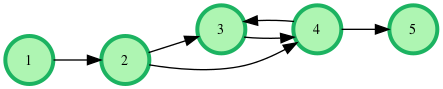
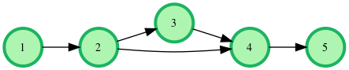
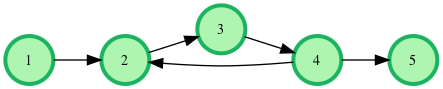

# kingdom-connectivity

It has been a prosperous year for King Charles and he is rapidly expanding his empire. In fact, he recently invaded his neighboring country and set up a new kingdom! This kingdom has many cities connected by one-way roads. To ensure higher connectivity, two cities are sometimes directly linked by more than one road.

In the new kingdom, King Charles has made one of the cities his financial capital and another city his warfare capital. He wants a better connectivity between these two capitals. The connectivity of a pair of cities, a and b, is defined as the number of different paths from city a to city b. A path may use a road more than once if possible. Two paths are considered different if they do not use the same sequence of roads the same number of times.

There are n cities numbered 1 to n in the new kingdom and m one-way roads. City 1 is the financial capital and city n is the warfare capital. Determine the number of different paths between cities 1 and n. Since the number may be large, print the result modulo 10^9 or 1000000000.

Note: Two roads may connect the same cities, but they are still considered distinct for path connections.

For example, there are n=5 cities connected by m=6 roads as shown in the following graph:

 

There are two direct paths and one cyclic path. Direct paths are 1→2→4→5 and 1→2→3 and 1→2→4→5. The cycle 3↔4 can be repeated any number of times, so there are infinite paths. If the connection 4→3 did not exist, there would be only the two direct paths.

### Function Description :

Complete the countPaths function in the editor below. It should print your result, modulo 10^9 if there are limited paths or INFINITE PATHS if they are unlimited. There is no expected return value.

countPaths has the following parameters:
- n: the integer number of cities
- edges: a 2D integer array where edges[i][0] is the source city and edges[i][1] is the destination city for the directed road 

### Input Format :

The first line contains two integers n and m.
Each of the following m lines contains two space-separated integers that represent source and destination cities for a directed connection.

### Constraints :

$$ 2 \le n \le 10^4 $$
$$ 1 \le m \le 10^5 $$
$$ 1 \le edges[i][0], edges[i][1] \le n $$

### Output Format :

Print the number of different paths from city 1 to city n modulo 10^9. If there are infinitely many different paths, print INFINITE PATHS.

### Sample Input :


<table width=100%>
<tr>
<th>Sample Input 0:</th>
<th>Sample Output 0:</th>
</tr>

<tr>
<td>

```
5 5  
1 2  
2 4  
2 3  
3 4  
4 5
```
</td>

<td>

```
2
```
</td>
</tr>
</table>

#### Explanation 0 :

 

There are two possible paths from city 1 to city n=5:

+ 1 → 2 → 3 → 4 → 5
+ 1 → 3 → 4 → 5


<table width=100%>
<tr>
<th>Sample Input 1:</th>
<th>Sample Output 1:</th>
</tr>

<tr>
<td>

```
5 5  
1 2  
4 2  
2 3  
3 4  
4 5
```
</td>

<td>

```
INFINITE PATHS 
```
</td>
</tr>
</table>

#### Explanation 0 :

 

The cycle in the graph can be traversed an infinite number of times on the way to city n.

### Solution :

We need to find the number of distinct paths from city 1 to city n in a directed graph. If there are cycles that lead to infinite paths, we should detect this and output "INFINITE PATHS". If the paths are finite, we should return the count modulo 10^9.

```cpp
#include <algorithm>
#include <cstdio>
#include <vector>

using namespace std;

// Constants and macros
#define REP(i, n) for (int i = 0; i < (n); i++)
#define pb push_back

// Constants
const int MAX_CITIES = 10000;
const int MOD = 1000000000;

// Graph representation
vector<int> adj[MAX_CITIES];  // Adjacency list for the main graph
vector<int> reverseAdj[MAX_CITIES];  // Adjacency list for the reversed graph

// Visited arrays for DFS
bool visitedFromStart[MAX_CITIES];  // Visited array for DFS from the start city
bool visitedFromEnd[MAX_CITIES];    // Visited array for DFS from the end city
bool visited[MAX_CITIES];           // General visited array for path counting

// DP memoization array
int memo[MAX_CITIES];

// Number of cities
int numCities;

// Function to read integers from input
int readInt() {
    int x;
    scanf("%d", &x);
    return x;
}

// DFS function to mark reachable nodes
void dfs(vector<int> graph[], bool visited[], int node) {
    visited[node] = true;
    for (int neighbor : graph[node]) {
        if (!visited[neighbor]) {
            dfs(graph, visited, neighbor);
        }
    }
}

// Function to count paths using postorder traversal
int countPaths(int node) {
    if (memo[node] != -1) {
        return memo[node];
    }

    int pathCount = 0;
    visited[node] = true;

    if (node == numCities - 1) {
        pathCount = 1;
    } else {
        for (int neighbor : adj[node]) {
            if (visitedFromStart[neighbor] && visitedFromEnd[neighbor]) {
                if (visited[neighbor]) {
                    throw 0;  // Cycle detected, leading to infinite paths
                }
                pathCount = (pathCount + countPaths(neighbor)) % MOD;
            }
        }
    }

    visited[node] = false;
    return memo[node] = pathCount;
}

int main() {
    numCities = readInt();
    int numEdges = readInt();

    // Read edges and construct the graph
    REP(i, numEdges) {
        int u = readInt() - 1;
        int v = readInt() - 1;
        adj[u].pb(v);
        reverseAdj[v].pb(u);
    }

    // Perform DFS from the start city (city 0) and the end city (city numCities-1)
    dfs(adj, visitedFromStart, 0);
    dfs(reverseAdj, visitedFromEnd, numCities - 1);

    // Initialize memo array with -1 (indicating uncomputed states)
    fill_n(memo, numCities, -1);

    // Try to compute the number of paths from city 0 to city numCities-1
    try {
        printf("%d\n", countPaths(0));
    } catch (...) {
        puts("INFINITE PATHS");
    }

    return 0;
}
```

### Key Concepts and Approach

+ Graph Representation:

    + We use adjacency lists to represent the directed graph (`adj`) and its reverse (`reverseAdj`). The reverse graph is useful for reverse reachability checks.

+ DFS for Reachability:

    + We perform two DFS traversals:
        + From the start node (city 1) to mark all reachable nodes.
        + From the end node (city n) to mark all nodes that can reach the end.

+ Cycle Detection:

    + During the DFS for path counting, we check if we revisit a node that's currently in the stack of the DFS traversal, indicating a cycle.

+ Dynamic Programming with Memoization:

    + We use a memoization array (`memo`) to store the number of paths from each node to the destination node. This helps avoid recomputation and efficiently counts paths.

+ Postorder Traversal:

    + We use postorder traversal in the DFS to ensure all possible paths from a node are computed before moving to the next node.

###  Detailed Code Walkthrough :

+ Constants and Macros:

    + `MAX_CITIES` and `MOD` are constants for maximum nodes and modulo operation respectively.
    + Macros for loops and push_back to simplify code.

+ Global Variables:

    + `adj` and `reverseAdj` store the graph and its reverse.
    + `visitedFromStart`, `visitedFromEnd`, and `visited` are arrays to track visited nodes.
    + `memo` stores the computed number of paths from each node.
    + `numCities` stores the number of cities.
 
+ Reading Input:

    + `readInt()` is a helper function to read integers from input.

+ DFS for Reachability:

    + `dfs()` marks all nodes reachable from a given node in the graph.

    + Two DFS calls are made:
        + One on `adj` from the start node (city 1).
        + One on `reverseAdj` from the end node (city n).

+ Postorder DFS for Path Counting:

    + `countPaths()` performs a DFS and uses memoization to count paths. If it encounters a cycle (a node being visited again), it throws an exception indicating infinite paths.

+ Main Function:

    + Reads the number of cities and roads.
    + Constructs the graph and its reverse from the input.
    + Performs DFS from both the start and end nodes to mark reachable nodes.
    + Initializes the memoization array.
    + Calls `countPaths(0)` (starting from city 1) and handles exceptions for infinite paths.

