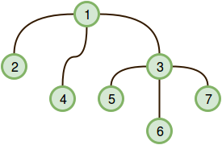

# kittys-calculations-on-a-tree

Kitty has a tree, T, consisting of n nodes where each node is uniquely labeled from 1 to n. Her friend Alex gave her q sets, where each set contains k distinct nodes. Kitty needs to calculate the following expression on each set:

$$ ( \sum_{{u, v}} u.v. dist(u, v)) *  mod (10^9 + 7) $$

where:
+ {u, v} denotes an unordered pair of nodes belonging to the set.
+ dist(u, v) denotes the number of edges on the unique (shortest) path between nodes u and v.

Given T and q sets of k distinct nodes, calculate the expression for each set. For each set of nodes, print the value of the expression modulo 10^9 +7 on a new line.

Example :

edges = [[1, 2], [1, 3], [1, 4], [3, 5], [3, 6], [3, 7]]

queries = [4, 5, 7]

The graph looks like this:

 

There are three pairs that can be created from the query set: [4, 5], [4, 7], [5, 7]. The distance from 4 to 5 is 3, from 4 to 7 is 3, and from 5 to 7 is 2.

Now do the summation:

$$
(4 \cdot 5 \cdot \text{dist}(4, 5) + 4 \cdot 7 \cdot \text{dist}(4, 7) + 5 \cdot 7 \cdot \text{dist}(5, 7)) \mod (10^9 + 7) \Rightarrow \\ (4 \cdot 5 \cdot 3 + 4 \cdot 7 \cdot 3 + 5 \cdot 7 \cdot 2) \mod (10^9 + 7) \Rightarrow 214
$$


Input Format :
The first line contains two space-separated integers, the respective values of n (the number of nodes in tree T) and q (the number of nodes in the query set).
Each of the n - 1 subsequent lines contains two space-separated integers, a and b, that describe an undirected edge between nodes a and b.
The 2.q subsequent lines define each set over two lines in the following format:
1. The first line contains an integer, k, the size of the set.
2. The second line contains k space-separated integers, the set's elements.

### Constraints

$$ 1 \le n \le 2.10^5 $$
$$ 1 \le a,b \le n $$
$$ 1 \le q \le 10^5 $$
$$ 1 \le k \le 10^5 $$

$$ The \ sum \  of \  k_i \  over  \ all \  q \  does \  not \  exceed  \ 2 * 10⁵. $$
$$ All \ elements \ in \ each \ set \ are \ distinct. $$

### Subtasks
+ 1 < n < 2000 for 24% of the maximum score.
+ 1 ≤ n ≤ 5.10^4 for 45% of the maximum score.
+ 1 ≤ n ≤ 2.10^5 for 100% of the maximum score.

### Output Format
Print q lines of output where each line i contains the expression for the ith query, modulo 10^9 + 7.


<table width=100%>
<tr>
<th>Sample Input 0:</th>
<th>Sample Output 0:</th>
</tr>

<tr>
<td>

```
7 3
1 2
1 3
1 4
3 5
3 6
3 7
2
2 4
1
5
3
2 4 5
```
</td>

<td>

```
16
0
106
```
</td>
</tr>

</table>

#### Explanation 0

Tree T looks like this:



We perform the following calculations for q=3 sets:

• `Set 0`: Given set {2, 4}, the only pair we can form is (u, v) = (2, 4), where dist(2, 4) = 2. We then calculate the following answer and print it on a new line:

$$
(2 \cdot 4 \cdot \text{dist}(2, 4)) \mod (10^9 + 7) \Rightarrow (2 \cdot 4 \cdot 2) \mod (10^9 + 7) \Rightarrow 16
$$


• `Set 1`: Given set {5}, we cannot form any pairs because we don't have at least two elements. Thus, we print 0 on a new line.

• `Set 2`: Given set {2, 4, 5}, we can form the pairs (2, 4), (2, 5), and (4,5). We then calculate the following answer and print it on a new line:

$$
(2 \cdot 4 \cdot \text{dist}(2, 4) + 2 \cdot 5 \cdot \text{dist}(2, 5) + 4 \cdot 5 \cdot \text{dist}(4, 5)) \mod (10^9 + 7) \Rightarrow \\ (2 \cdot 4 \cdot 2 + 2 \cdot 5 \cdot 3 + 4 \cdot 5 \cdot 3) \mod (10^9 + 7) \Rightarrow 106
$$

### Solution:

```cpp
#include <iostream>
#include <vector>
#include <algorithm>
#include <utility>

using namespace std;

using Graph = vector<vector<int>>; // Alias for the graph representation

const long mod = 1000000007; // Modulo value

// Class to record and manipulate values for each node
class Record {
    long s, su, sudu; // s: sum, su: sum of u, sudu: sum of u*v

public:
    Record(): s(0), su(0), sudu(0) { } // Constructor
    Record(int id): s(0), su(id), sudu(0) { } // Constructor with initial value

    int get_s() const { return s; } // Getter for sum value

    // Function to add values of another Record
    inline void add(Record &b) {
        long ns = (
            s + b.s
            + sudu * b.su
            + su * (b.sudu + b.su)
        );
        if (ns >= mod) ns %= mod;

        long nsu = su + b.su;
        if (nsu >= mod) nsu %= mod;

        long nsudu = sudu + b.sudu + b.su;
        if (nsudu >= mod) nsudu %= mod;

        s = ns;
        su = nsu;
        sudu = nsudu;
    }

    // Function to check if the record is zero
    inline bool zero() {
        return s == 0 && su == 0 && sudu == 0;
    }
};

// Class to generate and execute the code
class Code {
    vector<pair<int, int>> code; // Code representation

    // Recursive function to generate the code
    void gen_code(Graph &g, vector<bool> &color, int i) {
        color[i] = true;
        for (int child : g[i]) {
            if (color[child]) continue;

            gen_code(g, color, child);
            code.push_back({ child, i });
        }
    }

public:
    // Constructor to generate the code from the graph
    Code(Graph &g) {
        vector<bool> color(g.size());
        gen_code(g, color, 0); // Start with the root node (0)
    }

    // Function to execute the code and return the result
    int exec(vector<Record> &data) {
        int last = 0;
        for (auto c : code) {
            last = c.second;
            if (!data[c.first].zero())
                data[c.second].add(data[c.first]);
        }
        return data[last].get_s(); // Return the sum from the last node
    }
};

int main() {
    int n, q;
    cin >> n >> q;

    Graph g(n); // Graph representation
    for (int i = 0; i < n - 1; i++) {
        int a, b;
        cin >> a >> b;
        g[a - 1].push_back(b - 1); // Edge between nodes a and b
        g[b - 1].push_back(a - 1); // Edge between nodes b and a
    }

    Code code(g); // Generate code from the graph
    vector<Record> data(n); // Data for each node

    while (q--) {
        fill(data.begin(), data.end(), Record()); // Reset data for each query
        int m;
        cin >> m;
        while (m--) {
            int a;
            cin >> a;
            data[a - 1] = Record(a); // Initialize data for node a
        }

        cout << code.exec(data) << endl; // Execute the code and print the result
    }

    return 0;
}
```

### Problem Approach:

+ `Graph Representation`:

    + The problem involves working with a tree, which is represented as an undirected graph.
    + Each node in the tree has a unique label from 1 to n.
    + The graph is represented using an adjacency list.

+ `Centroid Decomposition`:

    + Centroid decomposition is a technique used to decompose a tree into smaller trees.
    + At each step, a centroid (a node whose removal splits the tree into smaller subtrees) is found.
    + The tree is recursively decomposed into smaller trees until each subtree is small enough to solve the problem efficiently.

+ `Dynamic Programming on Trees`:

    + Dynamic programming is applied to trees by traversing the tree in a bottom-up manner.
    + At each node, compute the necessary information based on its children and propagate it upwards.
    + This approach efficiently computes the required information for each node and allows solving the problem efficiently.


### Provided Code Explanation:

+ `Record Class`:

    + This class represents the values associated with each node in the tree.
    + It maintains three values: `s` (sum), `su` (sum of u), and `sudu` (sum of u * v).
    + Methods like `add` are provided to perform arithmetic operations on records.
    + The `zero` method checks if the record is zero.

+ `Code Class`:

    + This class generates and executes the code to calculate the result.
    + The `gen_code` method recursively generates the code by traversing the graph using depth-first search (DFS).
    + The `exec` method executes the generated code and returns the result.

+ `Main Function`:

    + Reads the input graph and queries.
    + Initializes the data for each query with the `Record` class.
    + Executes the code for each query and prints the result.