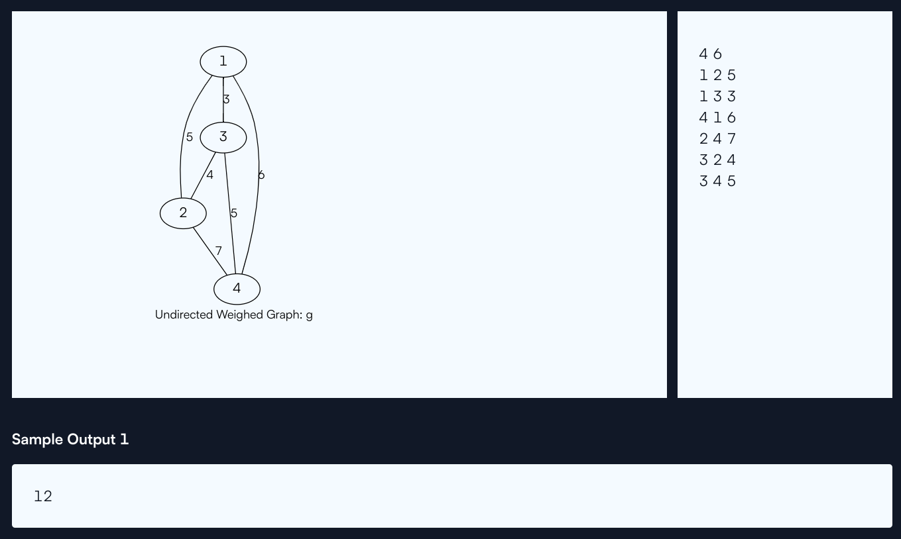
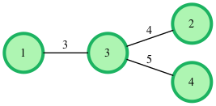
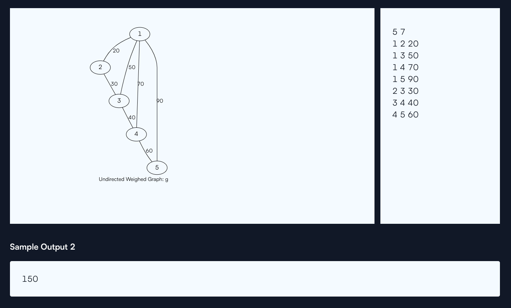

# kruskalmstrsub

Given an undirected weighted connected graph, find the Really Special SubTree in it. The Really Special SubTree is defined as a subgraph consisting of all the nodes in the graph and:

+ There is only one exclusive path from a node to every other node.
+ The subgraph is of minimum overall weight (sum of all edges) among all such subgraphs.
+ No cycles are formed

To create the Really Special SubTree, always pick the edge with smallest weight. Determine if including it will create a cycle. If so, ignore the edge. If there are edges of equal weight available:

+ Choose the edge that minimizes the sum u+v+wt where u and v are vertices and wt is the edge weight.
+ If there is still a collision, choose any of them.
Print the overall weight of the tree formed using the rules.

For example, given the following edges:

```
u	v	wt
1	2	2
2	3	3
3	1	5
```

First choose 1 → 2 at weight 2. Next choose 2 → 3 at weight 3. All nodes are connected without cycles for a total weight of 3 + 2 = 5.

### Function Description :

Complete the `kruskals` function in the editor below. It should return an integer that represents the total weight of the subtree formed.

kruskals has the following parameters:

+ `g_nodes`: an integer that represents the number of nodes in the tree
+ `g_from`: an array of integers that represent beginning edge node numbers
+ `g_to`: an array of integers that represent ending edge node numbers
+ `g_weight`: an array of integers that represent the weights of each edge

### Input Format :

The first line has two space-separated integers `g_nodes` and `g_edges`, the number of nodes and edges in the graph.

The next `g_edges` lines each consist of three space-separated integers `g_from`, `g_to` and `g_weight`, where `g_from` and `g_to` denote the two nodes between which the undirected edge exists and `g_weight` denotes the weight of that edge.

### Constraints :

$$ 2 \le g\_nodes \le 3000 $$
$$ 1 \le g\_edges \le \frac{N*(N-1)}{2} $$
$$ 1 \le g\_from, g\_to \le N $$
$$ 0 \le g\_weight \le 10^5 $$

**Note: ** If there are edges between the same pair of nodes with different weights, they are to be considered as is, like multiple edges.

### Output Format :

Print a single integer denoting the total weight of the Really Special SubTree.

#### Sample Input 1 :

 

### Explanation 1 :

The graph given in the test case is shown above.

Applying [Kruskal's algorithm](https://en.wikipedia.org/wiki/Kruskal%27s_algorithm), all of the edges are sorted in ascending order of weight.

After sorting, the edge choices are available as :

1→3(w=2), 2→3(w=4), 1→2(w=4), 3→4(w=5), 1→4(w=6) and 2→4(w=7).

 and 

Select 1→3(w=3) because it has the lowest weight without creating a cycle, Select 2→3 (w=4) because it has the lowest weight without creating a cycle

The edge 1→2(w=4) would form a cycle, so it is ignored

Select 3→4(w=5) to finish the MST yielding a total weight of 3+4+5=12.

 

#### Sample Input 2 :

 

#### Explanation 2

Given the graph above, select edges 1→2, 2→3, 3→4, 4→5 with weights 20+30+40+60 = 150.

## Solution : 

The problem is to find the Minimum Spanning Tree (MST) of a given undirected, weighted, and connected graph using Kruskal's algorithm. Kruskal's algorithm is a greedy algorithm that finds an MST by sorting the edges by weight and adding them one by one, ensuring no cycles are formed.

Here's a step-by-step explanation of the approach and code:

### Steps in Kruskal's Algorithm :
+ `Sort all the edges`: Sort the edges in non-decreasing order of their weight. If two edges have the same weight, use a tie-breaking rule to decide the order.
+ `Initialize the Union-Find structure`: This helps in efficiently checking if adding an edge would form a cycle and in merging sets of nodes.
+ `Iterate over sorted edges`: Add edges to the MST one by one, making sure not to form a cycle. Use the Union-Find structure to check for cycles and to union sets.
+ `Sum the weights of the edges in the MST`: This gives the total weight of the MST.

```cpp
#include <iostream>
#include <vector>
#include <algorithm>
#include <numeric>

using namespace std;

// Structure to represent an edge
struct Edge {
    int u, v, weight;
    bool operator<(const Edge& other) const {
        if (weight == other.weight) {
            return (u + v + weight) < (other.u + other.v + other.weight);
        }
        return weight < other.weight;
    }
};

// Find function with path compression
int find(vector<int>& parent, int u) {
    if (parent[u] != u) {
        parent[u] = find(parent, parent[u]);
    }
    return parent[u];
}

// Union function by rank
void union_sets(vector<int>& parent, vector<int>& rank, int u, int v) {
    int root_u = find(parent, u);
    int root_v = find(parent, v);
    if (root_u != root_v) {
        if (rank[root_u] > rank[root_v]) {
            parent[root_v] = root_u;
        } else if (rank[root_u] < rank[root_v]) {
            parent[root_u] = root_v;
        } else {
            parent[root_v] = root_u;
            rank[root_u]++;
        }
    }
}

// Kruskal's algorithm to find MST
int kruskals(int g_nodes, const vector<Edge>& edges) {
    vector<int> parent(g_nodes + 1);
    vector<int> rank(g_nodes + 1, 0);
    iota(parent.begin(), parent.end(), 0);
    
    int mst_weight = 0;
    
    for (const auto& edge : edges) {
        if (find(parent, edge.u) != find(parent, edge.v)) {
            union_sets(parent, rank, edge.u, edge.v);
            mst_weight += edge.weight;
        }
    }
    
    return mst_weight;
}

int main() {
    int g_nodes, g_edges;
    cin >> g_nodes >> g_edges;
    
    vector<Edge> edges(g_edges);
    
    for (int i = 0; i < g_edges; ++i) {
        cin >> edges[i].u >> edges[i].v >> edges[i].weight;
    }
    
    // Sort edges based on the custom comparator defined in the Edge structure
    sort(edges.begin(), edges.end());
    
    // Get the total weight of the MST
    int result = kruskals(g_nodes, edges);
    cout << result << endl;
    
    return 0;
}
```

### Edge Structure :
The `Edge` struct represents an edge in the graph:

```cpp
struct Edge {
    int u, v, weight;
    bool operator<(const Edge& other) const {
        if (weight == other.weight) {
            return (u + v + weight) < (other.u + other.v + other.weight);
        }
        return weight < other.weight;
    }
};
```

+ `u, v`: The two vertices connected by the edge.
+ `weight`: The weight of the edge.
+ `operator<`: A custom comparator that first sorts by weight. If weights are equal, it sorts by the sum 
u+v+weight.

### Union-Find Data Structure :
Union-Find (or Disjoint Set Union, DSU) is used to manage the sets of nodes and detect cycles efficiently:

```cpp
int find(vector<int>& parent, int u) {
    if (parent[u] != u) {
        parent[u] = find(parent, parent[u]);
    }
    return parent[u];
}

void union_sets(vector<int>& parent, vector<int>& rank, int u, int v) {
    int root_u = find(parent, u);
    int root_v = find(parent, v);
    if (root_u != root_v) {
        if (rank[root_u] > rank[root_v]) {
            parent[root_v] = root_u;
        } else if (rank[root_u] < rank[root_v]) {
            parent[root_u] = root_v;
        } else {
            parent[root_v] = root_u;
            rank[root_u]++;
        }
    }
}
```

+ `find`: Uses path compression to make future queries faster by flattening the structure of the tree.
+ `union_sets`: Uses union by rank to keep the tree flat, merging smaller trees under larger trees.

### Kruskal's Algorithm :
The kruskals function implements the core algorithm:

```cpp
int kruskals(int g_nodes, const vector<Edge>& edges) {
    vector<int> parent(g_nodes + 1);
    vector<int> rank(g_nodes + 1, 0);
    iota(parent.begin(), parent.end(), 0);
    
    int mst_weight = 0;
    
    for (const auto& edge : edges) {
        if (find(parent, edge.u) != find(parent, edge.v)) {
            union_sets(parent, rank, edge.u, edge.v);
            mst_weight += edge.weight;
        }
    }
    
    return mst_weight;
}
```

+ `parent`: Initializes each node to be its own parent.
+ `rank`: Initializes the rank of each node to 0.
+ `iota`: Fills the parent vector with values from 0 to g_nodes.
+ `mst_weight`: Accumulates the total weight of the MST.
+ `for loop`: Iterates through the sorted edges and adds them to the MST if they don't form a cycle.

### Summary :
+ The algorithm uses Kruskal's method to find the MST.
+ Sorting of edges is done with a custom comparator to handle tie-breaking.
+ Union-Find data structure ensures efficient cycle detection and union operations.
+ The total weight of the MST is computed and printed.

This approach ensures that the MST is found efficiently, even for large graphs, adhering to the constraints and tie-breaking rules provided in the problem statement.