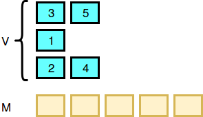
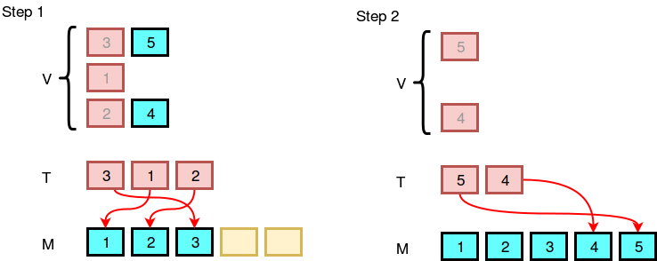

# sherlocks-array-merging-algorithm

Watson gave Sherlock a collection of arrays V. Here each V_i is an array of variable length. It is guaranteed that if you merge the arrays into one single array, you'll get an array, M, of n distinct integers in the range [1, n].

Watson asks Sherlock to merge V into a sorted array. Sherlock is new to coding, but he accepts the challenge and writes the following algorithm:

+ M ← [] (an empty array).
+ k ← number of arrays in the collection V.
+ While there is at least one non-empty array in V:
    + T ← [] (an empty array) and i ← 1.
    + While i ≤ k :
        + If V_i is not empty:
          + Remove the first element of V_i and push it to T.
        + i ← i + 1.
    + While T is not empty:
        + Remove the minimum element of T and push it to M.     
+ Return T as the output.
  
Let's see an example. Let V be { [3,5], [1], [2,4] }. The image below demonstrates how Sherlock will do the merging according to the algorithm:

 

Sherlock isn't sure if his algorithm is correct or not. He ran Watson's input, V, through his pseudocode algorithm to produce an output, M, that contains an array of n integers. However, Watson forgot the contents of V and only has Sherlock's M with him! Can you help Watson reverse-engineer M to get the original contents of V?

Given m, find the number of different ways to create collection V such that it produces m when given to Sherlock's algorithm as input. As this number can be quite large, print it modulo 10^9+7.

`Notes`:

+ Two collections of arrays are different if one of the following is true:

    + Their sizes are different.
    + Their sizes are the same but at least one array is present in one collection but not in the other.

+ Two arrays, A and B, are different if one of the following is true:

    + Their sizes are different.
    + Their sizes are the same, but there exists an index i such that a_i ≠ b_i. 

`Input Format` :

The first line contains an integer, n, denoting the size of array M.
The second line contains n space-separated integers describing the respective values of m_0, m_1, ..., m_{n-1}.

`Constraints` :

$$ 1 \le n \le 1200 $$

$$ 1 \le m_i \le n $$

`Output Format` :

Print the number of different ways to create collection V, modulo 10^9 + 7.

<table width=100%>
<tr>
<th>Sample Input 0:</th>
<th>Sample Output 0:</th>
</tr>

<tr>
<td>

```
3
1 2 3
```
</td>

<td>

```
4
```
</td>
</tr>
</table>

Explanation 0 :

There are four distinct possible collections:
+ 1. V = {[1,2,3]} 
+ 2. V = {[1], [2], [3]}
+ 3. V = {[1,3], [2]}
+ 4. v = {[1], [2,3]}

Thus, we print the result of 4 mod (10^9+7) = 4 as our answer.


<table width=100%>
<tr>
<th>Sample Input 1:</th>
<th>Sample Output 1:</th>
</tr>

<tr>
<td>

```
2
2 1
```
</td>

<td>

```
1
```
</td>
</tr>
</table>

Explanation 1 :

The only distinct possible collection is V = {[2, 1]}, so we print the result of 1mod(10^9+7) = 1 as our answer.

### Solution : 

```cpp
#include <iostream>
#include <cstring>
using namespace std;

const int MAX_N = 1205;
const int MOD = 1e9 + 7;

int n;
int m[MAX_N]; // Input array M
int right_bound[MAX_N]; // Right boundaries of increasing sequences

int factorial[MAX_N]; // Factorial array
int inverse_factorial[MAX_N]; // Inverse factorial array

int dp[MAX_N][MAX_N]; // Dynamic programming array

// Recursive function to compute the number of ways to create collection V
int countWays(int last, int pos) {
    // Base case: if we reached the end of array M, return the inverse of last
    if (pos > n) return inverse_factorial[last];

    // If the value is already computed, return it
    if (dp[last][pos] != -1) return dp[last][pos];

    long long res = 0;
    // Iterate over the possible next positions to split the array
    for (int i = pos; i <= min(right_bound[pos], last + pos - 1); ++i) {
        // Compute the number of ways recursively and update the result
        res += (((1LL * factorial[i - pos + 1] * countWays(i - pos + 1, i + 1)) % MOD) * inverse_factorial[last - (i - pos + 1)]) % MOD;
    }
    // Store the result in dp array and return it
    return dp[last][pos] = res % MOD;
}

int main() {
    cin >> n;
    // Input array M
    for (int i = 1; i <= n; ++i) {
        cin >> m[i];
    }
    // Calculate right boundaries of increasing sequences
    right_bound[n] = n;
    for (int i = n - 1; i >= 1; --i) {
        if (m[i + 1] > m[i]) right_bound[i] = right_bound[i + 1];
        else right_bound[i] = i;
    }
    // Precompute factorial array
    factorial[0] = 1;
    for (int i = 1; i <= n; ++i) {
        factorial[i] = (1LL * factorial[i - 1] * i) % MOD;
    }
    // Precompute inverse factorial array using modulo inverse
    inverse_factorial[0] = 1;
    inverse_factorial[1] = 1;
    for (int i = 2; i <= n; ++i) {
        inverse_factorial[i] = ((-1LL * (MOD / i) * inverse_factorial[MOD % i]) % MOD + MOD) % MOD;
    }
    for (int i = 2; i <= n; ++i) {
        inverse_factorial[i] = (1LL * inverse_factorial[i - 1] * inverse_factorial[i]) % MOD;
    }
    // Initialize dp array with -1
    memset(dp, -1, sizeof(dp));

    int ans = 0;
    // Compute the answer
    for (int i = 1; i <= right_bound[1]; ++i) {
        ans += (1LL * factorial[i] * countWays(i, i + 1)) % MOD;
        if (ans >= MOD) ans -= MOD;
    }
    cout << ans << endl; // Output the answer
    return 0;
}
```
### Code Walkthrough : 

This is a problem from Dynamic Programming.

### Header Files and Namespaces:

```cpp
#include <iostream>
#include <cstring>
using namespace std;
```

These lines include necessary header files for input-output operations and string manipulation. The `using namespace std`; directive allows using standard namespace functions and objects without prefixing them with `std::`.

### Constants and Arrays:

```cpp
const int MAX_N = 1205;
const int MOD = 1e9 + 7;

int n;
int m[MAX_N]; // Input array M
int right_bound[MAX_N]; // Right boundaries of increasing sequences

int factorial[MAX_N]; // Factorial array
int inverse_factorial[MAX_N]; // Inverse factorial array

int dp[MAX_N][MAX_N]; // Dynamic programming array
```

+ `MAX_N` defines the maximum size of arrays.
+ `MOD` is the modulo value.
+ `m` stores the input array M.
+ `right_bound` stores the right boundaries of increasing sequences.
+ `factorial` stores factorials.
+ `inverse_factorial` stores inverse factorials.
+ `dp` is a dynamic programming array.

### Recursive Function `countWays`:

```cpp
int countWays(int last, int pos) {
    if (pos > n) return inverse_factorial[last];
    if (dp[last][pos] != -1) return dp[last][pos];

    long long res = 0;
    for (int i = pos; i <= min(right_bound[pos], last + pos - 1); ++i) {
        res += (((1LL * factorial[i - pos + 1] * countWays(i - pos + 1, i + 1)) % MOD) * inverse_factorial[last - (i - pos + 1)]) % MOD;
    }
    return dp[last][pos] = res % MOD;
}
```

+ `Parameters`: `last` is the length of the last segment considered, `pos` is the current position in the array `m`.
+ `Base Case`: If `pos` exceeds `n`, return the inverse factorial of `last` (no more elements to consider).
+ `Memoization`: If the result for `dp[last][pos]` is already computed, return it.
+ `Recursive Calculation`: Iterate over possible next positions (`i`) to split the array. For each position `i`, the function makes a recursive call to `countWays` with the new segment length `i - pos + 1` and the new starting position `i + 1`.
    + Calculate the number of ways recursively.
    + Multiply with factorial and inverse factorial for proper combination counting, ensuring results are modulo `MOD`.
        + `factorial[i - pos + 1]`: Factorial of the length of the new segment.
        + `countWays(i - pos + 1, i + 1)`: Recursive call for the next segment.
        + `inverse_factorial[last - (i - pos + 1)]`: Inverse factorial of the remaining length after considering the new segment.
+ `Memoize and Return Result`: Store the result in `dp` and return it.

### Main Function:

```cpp
int main() {
    cin >> n;
    for (int i = 1; i <= n; ++i) {
        cin >> m[i];
    }

    // Calculate right boundaries of increasing sequences
    right_bound[n] = n;
    for (int i = n - 1; i >= 1; --i) {
        if (m[i + 1] > m[i]) right_bound[i] = right_bound[i + 1];
        else right_bound[i] = i;
    }

    // Precompute factorial array
    factorial[0] = 1;
    for (int i = 1; i <= n; ++i) {
        factorial[i] = (1LL * factorial[i - 1] * i) % MOD;
    }

    // Precompute inverse factorial array using modulo inverse
    inverse_factorial[0] = 1;
    inverse_factorial[1] = 1;
    for (int i = 2; i <= n; ++i) {
        inverse_factorial[i] = ((-1LL * (MOD / i) * inverse_factorial[MOD % i]) % MOD + MOD) % MOD;
    }
    for (int i = 2; i <= n; ++i) {
        inverse_factorial[i] = (1LL * inverse_factorial[i - 1] * inverse_factorial[i]) % MOD;
    }

    memset(dp, -1, sizeof(dp)); // Initialize dp array with -1

    int ans = 0;
    // Compute the answer
    for (int i = 1; i <= right_bound[1]; ++i) {
        ans += (1LL * factorial[i] * countWays(i, i + 1)) % MOD;
        if (ans >= MOD) ans -= MOD;
    }
    cout << ans << endl; // Output the answer
    return 0;
}
```

#### `Input Reading`:

+ Read the integer `n` (size of array `m`).
+ Read the elements of the array `m`.

#### `Right Boundaries Calculation`:

+ Initialize `right_bound[n]` to `n`.
+ Traverse the array from the end to the beginning:
    + If the next element is greater, propagate the right boundary.
    + Otherwise, set the right boundary to the current index.

#### `Factorials and Inverse Factorials Precomputation`:

+ Compute the factorials modulo `MOD`.
+ Compute the modular inverses of the factorials using the property:
    + `inverse_factorial[i] = ((-1 * (MOD / i) *  inverse_factorial[MOD % i]) % MOD + MOD) % MOD`.

        Inverse Factorial using Fermat’s Little Theorem.
+ Ensure results are modulo `MOD`.

#### `Initialize dp Array`:

+ Set all elements of `dp` to `-1` using `memset`.

#### `Compute the Answer`:

+ Iterate over possible initial segment lengths.
+ Use the `countWays` function to compute the number of valid ways for each segment length.
+ Sum the results, ensuring the sum is modulo `MOD`.

#### `Output the Result`:

+ Print the computed answer.

The `countWays` function calculates the number of ways to split the array starting from a given position into increasing subsequences. It uses:

+ `Recursion`: To explore all possible ways to split the array.
+ `Memoization`: To store already computed results for efficiency.
+ `Factorials and Inverse Factorials`: To correctly handle combinations under modular arithmetic constraints.

This approach ensures that all possible partitions are considered efficiently, and the results are computed accurately within the constraints of the problem.

This code efficiently calculates the number of different ways to create collection V, satisfying the conditions specified in the problem statement. 
