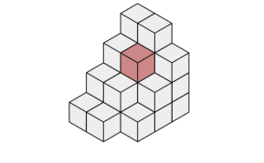

# Standard Template Library (STL) 🌸

Some of the key components of the STL include:
- Containers: The STL provides a range of containers, such as vector, list, map, set, and stack, which can be used to store and manipulate data.
- Algorithms: The STL provides a range of algorithms, such as sort, find, and binary_search, which can be used to manipulate data stored in containers.
- Iterators: Iterators are objects that provide a way to traverse the elements of a container. The STL provides a range of iterators, such as forward_iterator, bidirectional_iterator, and random_access_iterator, that can be used with different types of containers.
- Function Objects: Function objects, also known as functors, are objects that can be used as function arguments to algorithms. They provide a way to pass a function to an algorithm, allowing you to customize its behavior.
- Adapters: Adapters are components that modify the behavior of other components in the STL. For example, the reverse_iterator adapter can be used to reverse the order of elements in a container.


```cpp

#include <iostream>
#include <vector>
using namespace std;
 
int main() {

   // create a vector to store int
   vector<int> vec; 
   int i;

   // display the original size of vec
   cout << "vector size = " << vec.size() << endl;

   // push 5 values into the vector
   for(i = 0; i < 5; i++) {
      vec.push_back(i);
   }

   // display extended size of vec
   cout << "extended vector size = " << vec.size() << endl;

   // access 5 values from the vector
   for(i = 0; i < 5; i++) {
      cout << "value of vec [" << i << "] = " << vec[i] << endl;
   }

   // use iterator to access the values
   vector<int>::iterator v = vec.begin();
   while( v != vec.end()) {
      cout << "value of v = " << *v << endl;
      v++;
   }

   return 0;
}

```

<table width=100%>

<tr>
<th>std::array</th>
<th>std::vector</th>
</tr>
<tr>
<td>

First item: `arr.front() == arr[0]` and Last item: `arr.back() == arr[arr.size() - 1`.

```cpp

 #include <array>
 #include <iostream>
 using std :: cout;
 using std :: endl;

 int main () {
 std ::array <float , 3> data {10.0F, 100.0F, 1000.0F};

 for (const auto& elem : data) {
 cout << elem << endl;
 }

 cout << std :: boolalpha ;
 cout << "Array empty: " << data.empty() << endl;
 cout << "Array size : " << data.size() << endl;
 }

```

</td>
<td>

Vector is implemented as a dynamic table. Remove all elements: `vec.clear()`. Add a new item in one of two ways:
`vec.emplace_back(value)` [preferred, c++11]. reserve(n) ensures that the vector has enough memory to store n items (useful optimization).


```cpp
#include <iostream>
#include <string>
#include <vector>
using std :: cout;
using std :: endl;

int main () {
std :: vector <int> numbers = {1, 2, 3};
std :: vector <std :: string > names = {"Nacho", "Cyrill"};

 names.emplace_back ("Roberto");

 cout << "First name : " << names.front()<< endl;
 cout << "Last number: " << numbers.back()<< endl;
 return 0;
 }

```
Optimize vector resizing:

```cpp

 int main () {
 const int N = 100;

 vector <int> vec; // size 0, capacity 0
 vec.reserve(N); // size 0, capacity 100
 for (int i = 0; i < N; ++i) {
 vec.emplace_back (i);
 }
 // vec ends with size 100, capacity 100

 vector <int> vec2; // size 0, capacity 0
 for (int i = 0; i < N; ++i) {
 vec2.emplace_back (i);
 }
 // vec2 ends with size 100, capacity 128
 }

```
</td>
</tr>


<tr>
<th>Containers in CV (Open3D::PointCloud)</th>
<th>std::map</th>
</tr>
<tr>
<td>

```cpp

std::vector <Eigen :: Vector3d> points_;
std::vector <Eigen :: Vector3d> normals_;
std::vector <Eigen :: Vector3d> colors_;
```

sizeof():

```cpp

 int data [17];
 size_t data_size = sizeof(data) / sizeof(data [0]);
 printf("Size of array: %zu\n", data_size );

```
size():

```cpp

 std ::array <int, 17> data_ {};
 cout << "Size of array: " << data_.size () << endl;

```
Empty Container : No standard way of checking if empty

```cpp

 int empty_arr [10];
 printf("Array empty: %d\n", empty_arr [0] == NULL);

 int full_arr [5] = {1, 2, 3, 4, 5};
 printf("Array empty: %d\n", full_arr [0] == NULL);

```

empty():


```cpp

 std :: vector <int> empty_vec_ {};
 cout << "Array empty: " << empty_vec_ .empty () << endl;

 std :: vector <int> full_vec_ {1, 2, 3, 4, 5};
 cout << "Array empty: " << full_vec_ .empty () << endl;


```
Access last element : No robust way of doing it

```cpp
 float f_arr[N] = {1.5 , 2.3};
 // is it 3, 2 or 900?
 printf("Last element: %f\n", f_arr [3]);
```
back():
```cpp
 std ::array <float , 2> f_arr_ {1.5 , 2.3};
 cout << "Last Element: " << f_arr_.back () << endl;
```
Clear elements : External function call, doesn’t always
work with floating points
```cpp
 char letters [5] = {'n', 'a', 'c', 'h', 'o'};
 memset(letters , 0, sizeof(letters));

```
clear():
```cpp
 std :: vector <char > letters_ = {'n', 'a', 'c', 'h', 'o'};
 letters_.clear ();

```
Remember std::string:
```cpp
std :: string letters_right_ {"nacho"};
letters_right_ .clear ();


```


</td>
<td>

Sorted associative container and Contains key-value pairs (dictionaries dict in Python).

```c++

 #include <iostream>
 #include <map>
 using namespace std;

 int main () {
 using StudentList = std ::map <int, string >;
 StudentList cpp_students ;

 // Inserting data in the students dictionary
 cpp_students.emplace (1509 , "Nacho"); // [1]
 cpp_students.emplace (1040 , "Pepe"); // [0]
 cpp_students.emplace (8820 , "Marcelo"); // [2]

 for (const auto& [id , name] : cpp_students ) {
 cout << "id: " << id << ", " << name << endl;
 }

 return 0;
 }


```
Create from data: ` std ::map <KeyT , ValueT > m{{key1 , value1}, {..}};`

Check size: `m.size();`

Add item to map: `m.emplace(key, value);`

Modify or add item: `m[key] = value;`

Get (const) ref to an item: `m.at(key);`

Check if key present: `m.count(key) > 0;`

Check if key present: `m.contains(key)` [bool]


</td>
</tr>

<tr>
<th>std::unordered_map</th>
<th>Open3D::VoxelGrid</th>
</tr>
<tr>
<td>
Implemented as a hash table and Key type has to be hashable.

```cpp

 #include <iostream>
 #include <unordered_map>
 using namespace std;

 int main () {
 using StudentList = std :: unordered_map <int, string >;
 StudentList cpp_students ;

 // Inserting data in the students dictionary
 cpp_students .emplace (1509 , "Nacho"); // [2]
 cpp_students .emplace (1040 , "Pepe"); // [1]
 cpp_students .emplace (8820 , "Marcelo"); // [0]

 for (const auto& [id , name] : cpp_students ) {
 cout << "id: " << id << ", " << name << endl;
 }

 return 0;
 }


 #include <functional >
 template <> struct hash <bool >;
 template <> struct hash <char >;
 template <> struct hash <signed char >;
 template <> struct hash <unsigned char >;
 template <> struct hash <char8_t >; // C++20
 template <> struct hash <char16_t >;
 template <> struct hash <char32_t >;
 template <> struct hash <wchar_t >;
 template <> struct hash <short >;
 template <> struct hash <unsigned short >;
 template <> struct hash <int >;
 template <> struct hash <unsigned int >;
 template <> struct hash <long >;
 template <> struct hash <long long >;
 template <> struct hash <unsigned long >;
 template <> struct hash <unsigned long long >;
 template <> struct hash <float >;
 template <> struct hash <double >;
 template <> struct hash <long double >;
 template <> struct hash <std :: nullptr_t >; // C++17
```

Iterating over maps:

```cpp
 std ::map <char , int> my_dict {{'a', 27}, {'b', 3}};
 for (const auto& [key , value] : my_dict) {
    cout << key << " has value " << value << endl;

```

`map` has keys sorted and `unordered_map` has keys in random order.


</td>
<td>

```cpp
 std :: unordered_map <Eigen :: Vector3i, Voxel , hash_eigen ::hash <Eigen :: Vector3i >> voxels_;

```



</td>
</tr>

</table>

## STL Algorithms :

<table width=100%>
<tr>
<th>std::sort</th>
<th>std::find</th>
</tr>
<tr>
<td>

```cpp

 int main () {
 array <int, 10> s = {5, 7, 4, 2, 8, 6, 1, 9, 0, 3};

 cout << "Before sorting: ";
 Print(s);

 std :: sort(s.begin (), s.end ());
 cout << "After sorting: ";
 Print(s);

 return 0;
 }

```

</td>
<td>

```cpp

 int main () {
 const int n1 = 3;
 std :: vector <int> v{0, 1, 2, 3, 4};

 auto result1 = std :: find(v.begin (), v.end (), n1);

 if (result1 != std :: end(v)) {
 cout << "v contains: " << n1 << endl;
 } else {
 cout << "v does not contain: " << n1 << endl;
 }
 }

```

</td>
</tr>

<tr>
<th>std::fill</th>
<th>std::count</th>
</tr>
<tr>
<td>

```cpp

 int main () {
 std :: vector <int> v{0, 1, 2, 3, 4, 5, 6, 7, 8, 9};

 std :: fill(v.begin (), v.end (), -1);

 Print(v);
 }

```

</td>
<td>

```cpp

 int main () {
 std :: vector <int> v{1, 2, 3, 4, 4, 3, 7, 8, 9, 10};

 const int n1 = 3;
 const int n2 = 5;
 int num_items1 = std :: count(v.begin (), v.end (), n1);
 int num_items2 = std :: count(v.begin (), v.end (), n2);
 cout << n1 << " count: " << num_items1 << endl;
 cout << n2 << " count: " << num_items2 << endl;

 return 0;
 }

```

</td>
</tr>


<tr>
<th>std::count_if</th>
<th>std::for_each</th>
</tr>
<tr>
<td>

```cpp

 inline bool div_by_3(int i) { return i % 3 == 0; }

 int main () {
 std :: vector <int> v{1, 2, 3, 3, 4, 3, 7, 8, 9, 10};

 int n3 = std :: count_if(v.begin (), v.end (), div_by_3);
 cout << "# divisible by 3: " << n3 << endl;
 }


```

</td>
<td>

```cpp

 int main () {
 std :: vector <int> nums {3, 4, 2, 8, 15, 267};

 // lambda expression , lecture_9
 auto print = [](const int& n) { cout << " " << n; };

 cout << "Numbers:";
 std :: for_each(nums.cbegin (), nums.cend (), print);
 cout << endl;

 return 0;
 }

```

</td>
</tr>


<tr>
<th>std::all_off</th>
<th>std::rotate</th>
</tr>
<tr>
<td>

```cpp

 inline bool even(int i) { return i % 2 == 0; };
 int main () {
 std :: vector <int> v(10, 2);
 std :: partial_sum (v.cbegin (), v.cend (), v.begin ());
 Print(v);

 bool all_even = all_of(v.cbegin (), v.cend (), even);
 if (all_even ) {
 cout << "All numbers are even" << endl;
 }
 }


```

</td>
<td>

```cpp

 int main () {
 std :: vector <int> v{1, 2, 3, 4, 5, 6, 7, 8, 9, 10};
 cout << "before rotate: ";
 Print(v);

 std :: rotate(v.begin (), v.begin () + 2, v.end ());
 cout << "after rotate: ";
 Print(v);
 }


```

</td>
</tr>


<tr>
<th>std::transform</th>
<th>std::accumulate</th>
</tr>
<tr>
<td>

```cpp

 auto UpperCase (char c) { return std :: toupper(c); }
 int main () {
 const std :: string s("hello");
 std :: string S{s};
 std :: transform (s.begin (),
 s.end (),
 S.begin (),
 UpperCase );

 cout << s << endl;
 cout << S << endl;
 }

```

</td>
<td>

```cpp

 int main () {
 std :: vector <int> v{1, 2, 3, 4, 5, 6, 7, 8, 9, 10};

 int sum = std :: accumulate (v.begin (), v.end (), 0);

 int product = std :: accumulate (v.begin (), v.end (), 1, std :: multiplies ());

 cout << "Sum : " << sum << endl;
 cout << "Product: " << product << endl;
 }

```

</td>
</tr>


<tr>
<th>std::max</th>
<th>std::min_element</th>
</tr>
<tr>
<td>

```cpp

 int main () {
 using std :: max;
 cout << "max(1, 9999) : " << max(1, 9999) << endl;
 cout << "max('a', 'b'): " << max('a', 'b') << endl;
 }

```

</td>
<td>

```cpp
 int main () {
 std :: vector <int> v{3, 1, 4, 1, 0, 5, 9};

 auto result = std :: min_element (v.begin (), v.end ());
 auto min_location = std :: distance(v.begin (), result);
 cout << "min at: " << min_location << endl;
 }


```

</td>
</tr>


<tr>
<th>std::minmax_element</th>
<th>std::clamp</th>
</tr>
<tr>
<td>

```cpp
 int main () {
 using std :: minmax_element ;

 auto v = {3, 9, 1, 4, 2, 5, 9};
 auto [min , max] = minmax_element (begin(v), end(v));

 cout << "min = " << *min << endl;
 cout << "max = " << *max << endl;
 }
```

</td>
<td>

```cpp


 int main () {
 // value should be between [kMin ,kMax]
 const double kMax = 1.0F;
 const double kMin = 0.0F;

 cout << std :: clamp (0.5 , kMin , kMax) << endl;
 cout << std :: clamp (1.1 , kMin , kMax) << endl;
 cout << std :: clamp (0.1 , kMin , kMax) << endl;
 cout << std :: clamp (-2.1, kMin , kMax) << endl;
 }

```

</td>
</tr>


<tr>
<th>std::sample</th>
</tr>
<tr>
<td>

```cpp
 int main () {
 std :: string in = "C++ is cool", out;
 auto rnd_dev = std :: mt19937{ random_device {}() };
 const int kNLetters = 5;
 std :: sample(in.begin (),
 in.end (),
 std :: back_inserter (out),
 kNLetters ,
 rnd_dev);

 cout << "from : " << in << endl;
 cout << "sample: " << out << endl;
 }
```

</td>
</tr>

</table>

resources: [The C++ Standard Template Library (STL)](https://www.geeksforgeeks.org/the-c-standard-template-library-stl/), [cplusplus/stl](https://cplusplus.com/reference/stl/)
