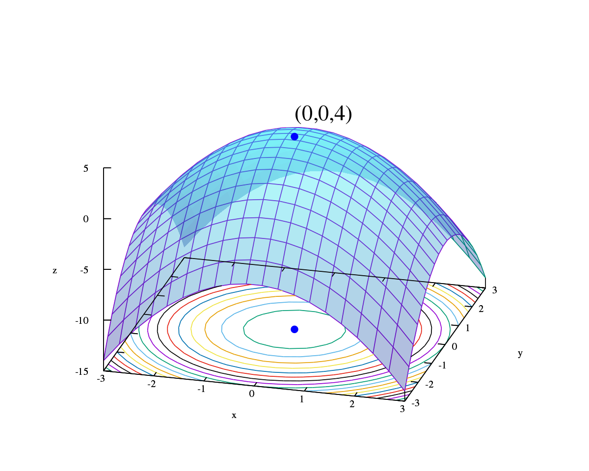

$\Huge Mathematics!$
$\huge Mathematics!$
$\LARGE Mathematics!$
$\Large Mathematics!$
$\large Mathematics!$
$\normalsize Mathematics!$
$\small Mathematics!$
$\scriptsize Mathematics!$
$\tiny Mathematics!$ for ML :))  🌸 

<br />


$$ \color{blue}{X \sim Normal \; (\mu,\sigma^2)} $$


$$P \left( A=2 \, \middle| \, \dfrac{A^2}{B}>4 \right) $$

Mathematics is beautiful and imperative for problem solving with control. Important concepts to be comfortable around with : Linear Algebra, Matrix Decomposition, Analytical Geometry,  Calculus, Probability and Statistics.

<br />

<table width=100%>
<tr>
<th>Practical Mathematics ( c++ / py  )


[ [code](./mcode.MD) ]

</th>

<th>Optimizations



[ [code](./op.MD) ]

</th>
</tr>
</table>

### book : [Mathematics for ML](https://course.ccs.neu.edu/ds4420sp20/readings/mml-book.pdf) | series : [Weights & Biases](https://www.youtube.com/watch?v=uZeDTwWcnuY&list=PLD80i8An1OEGZ2tYimemzwC3xqkU0jKUg), [StatQuest](https://www.youtube.com/watch?v=Gv9_4yMHFhI&list=PLblh5JKOoLUICTaGLRoHQDuF_7q2GfuJF), [3Blue1Brown ](https://www.youtube.com/@3blue1brown)

## Mathematics NOTES 📖:

` > LINEAR ALGEBRA`: [M4ML - Linear Algebra](https://www.youtube.com/watch?v=T73ldK46JqE&list=PLiiljHvN6z1_o1ztXTKWPrShrMrBLo5P3), [3b1b - Essence of Linear Algebra](https://www.youtube.com/watch?v=kjBOesZCoqc&list=PL0-GT3co4r2y2YErbmuJw2L5tW4Ew2O5B), [MIT 18.06 Linear Algebra - Gilbert Strang](https://www.youtube.com/watch?v=QVKj3LADCnA&list=PL49CF3715CB9EF31D) <br />
{ [linear_algebra_cs229.pdf](./notes/cs229-linalg.pdf), [linear_algebra_review.pdf](./notes/cs229-linalg2.pdf), [vip_referesher_linear_algebra.pdf](./notes/linear-algebra.pdf) } 📖

Linear algebra forms the backbone of many machine learning algorithms, particularly in handling high-dimensional data. Key concepts include vectors, matrices, matrix operations (addition, multiplication), and linear transformations. Examples:
+ Representation of datasets as matrices.
+ Matrix multiplication for linear transformations in neural networks.

Eigenvalues and eigenvectors are used in algorithms like Principal Component Analysis (PCA), which reduces the dimensionality of the data.

```python
# Eigenvalues and Eigenvectors
A = np.array([[3, 1], [1, 3]])

# Compute eigenvalues and eigenvectors
eigenvalues, eigenvectors = np.linalg.eig(A)

print("Eigenvalues:", eigenvalues)
print("Eigenvectors:\n", eigenvectors)
```

In machine learning, the gradient is the vector of partial derivatives of a function. In linear regression, gradients are used for updating weights during training.

```python
# Example data (features and labels)
X = np.array([[1, 1], [1, 2], [2, 2], [2, 3]])  # Features
y = np.dot(X, np.array([1, 2])) + 3  # Labels

# Initial weights
w = np.array([0.1, 0.2])

# Predicted values
y_pred = np.dot(X, w)

# Compute gradients (partial derivatives of Mean Squared Error Loss)
gradient = np.dot(X.T, (y_pred - y)) / len(y)

print("Gradient:", gradient)
```

In Robotics [SLAM] : `Lie Group`: A Lie group is a group that is also a differentiable manifold, meaning it has a smooth structure that allows for calculus to be performed. The group operations (multiplication and inversion) are smooth maps. Lie groups are used to study continuous symmetries.

`Lie Algebra`: Associated with every Lie group is a Lie algebra, which is a vector space equipped with a binary operation called the Lie bracket. The Lie algebra captures the infinitesimal structure of the Lie group and is crucial in understanding its properties.

 More on Lie Group and Lie Algebra from my notes @[slam/lie](https://github.com/florist-notes/aicore_n/blob/main/notes/code/slam/lieg.MD)

<br />

$$
A_{m,n} = 
\begin{pmatrix}
a_{1,1} & a_{1,2} & \cdots & a_{1,n} \\
a_{2,1} & a_{2,2} & \cdots & a_{2,n} \\
\vdots & \vdots & \ddots & \vdots \\
a_{m,1} & a_{m,2} & \cdots & a_{m,n} 
\end{pmatrix}
$$

<br />

Matrix Decomposition: [MIT 18.065 Matrix Methods in Data Analysis, Signal Processing, and ML](https://www.youtube.com/playlist?list=PLUl4u3cNGP63oMNUHXqIUcrkS2PivhN3k)<br />

`> ANALYTIC GEOMETRY`: [MIT Graph and Geometry Reading Group](https://www.youtube.com/playlist?list=PLoVkjhDgBOt2UwOm70DAuxHf1Jc9ijmzl) [ Discrete Differential Geometry - [CMU 15-458/858](https://www.youtube.com/playlist?list=PL9_jI1bdZmz0hIrNCMQW1YmZysAiIYSSS) ]<br />
{ [Geometric foundations of deep learning](https://towardsdatascience.com/geometric-foundations-of-deep-learning-94cdd45b451d), @github/[awesome-neural-geometry](https://github.com/neurreps/awesome-neural-geometry), [AMMI 2022 Course "Geometric Deep Learning" ](https://www.youtube.com/watch?v=5c_-KX1sRDQ&list=PLn2-dEmQeTfSLXW8yXP4q_Ii58wFdxb3C), [Geometric Deep Learning](https://a-j.gitbook.io/geometric-deep-learning/), [mathematical_methods_computervision_robotics_graphics.pdf](./notes/cs205a_notes.pdf) }


`> CALCULUS` : [Calculus I (Limits, Derivative, Integrals)](https://www.youtube.com/playlist?list=PLHXZ9OQGMqxfT9RMcReZ4WcoVILP4k6-m), [Calculus II (Integration Methods, Series, Parametric/Polar, Vectors)](https://www.youtube.com/playlist?list=PLHXZ9OQGMqxc4ySKTIW19TLrT91Ik9M4n), [Calculus III: Multivariable Calculus (Vectors, Curves, Partial Derivatives, Integration](https://www.youtube.com/playlist?list=PLHXZ9OQGMqxc_CvEy7xBKRQr6I214QJcd), [Mathematics for Machine Learning - Multivariate Calculus](https://www.youtube.com/playlist?list=PLiiljHvN6z193BBzS0Ln8NnqQmzimTW23); VECTOR CALCULUS: [Calculus IV: Vector Calculus](https://www.youtube.com/watch?v=AIxiYG-gZ00&list=PLHXZ9OQGMqxfW0GMqeUE1bLKaYor6kbHa).

Calculus provides tools for optimization, which is fundamental in training machine learning models. Concepts such as derivatives, gradients, and optimization techniques like gradient descent are indispensable. Examples:
+ Calculating gradients for updating model parameters in gradient descent.
+ Using second derivatives for optimization methods like Newton's method.<br />

In optimization and machine learning, the Jacobian matrix represents the gradient of a vector-valued function, and the Hessian matrix represents the second-order partial derivatives of a scalar function. Let's compute the Hessian matrix for :

$$ f(x,y)=x^2 + y^2 $$

```python
import autograd.numpy as np
from autograd import jacobian, hessian

# Define a multivariable function f(x, y) = x^2 + y^2
def f_xy(params):
    x, y = params
    return x**2 + y**2

# Compute the Jacobian and Hessian of f
jacobian_f = jacobian(f_xy)
hessian_f = hessian(f_xy)

# Evaluate at (x, y) = (1, 2)
params = np.array([1.0, 2.0])
print("Jacobian at (1, 2):", jacobian_f(params))
print("Hessian at (1, 2):\n", hessian_f(params))
```

`> PROBABILITY AND DISTRIBUTION`: [Random Variable and Probability Distribution](https://www.youtube.com/watch?v=3v9w79NhsfI&list=PLU5aQXLWR3_xDN0M2ZeZ_zHIia0e42_3O), [Discrete Probability](https://www.youtube.com/watch?v=rifK8BtHaYI&list=PLIeGtxpvyG-LWd2IOW1wveszJXy_aHytX)<br />
{ [prob_theory_review_for_ml.pdf](./notes/cs229-prob.pdf), [review_probability_theory.pdf](./notes/cs229-prob2.pdf), [vip_refresher_probability_statistics.pdf](./notes/refresher-probabilities-statistics.pdf)  } 📖

Probability theory deals with uncertainty and randomness. Concepts include probability distributions, conditional probability, and Bayes' theorem. Examples:
+ Gaussian distribution in Gaussian Naive Bayes classifier.
+ Conditional probability in Hidden Markov Models.

<br />

$$\dfrac{n!}{k!(n-k)!} = \binom{n}{k}$$

<br />

`> CONTINUOUS OPTIMIZATION`: [Optimization Methods for Machine Learning and Engineering](https://www.youtube.com/playlist?list=PLdkTDauaUnQpzuOCZyUUZc0lxf4-PXNR5), [CS769 - Optimization in Machine Learning](https://www.youtube.com/watch?v=ydFjUzqyZkw&list=PLyo3HAXSZD3xk6Bc3Fri5-efbi4NKDtlO) <br />

Optimization techniques are crucial for training machine learning models by finding the optimal parameters that minimize a cost function. Concepts include convex optimization, constrained optimization, and stochastic optimization. Examples:
+ Gradient descent for optimizing neural network weights.
+ L-BFGS (Limited-memory Broyden–Fletcher–Goldfarb–Shanno) for constrained optimization.

Information theory provides insights into the representation and transmission of information. Concepts include entropy, mutual information, and the Kullback-Leibler divergence. Examples:
+ Cross-entropy loss function in classification tasks.
+ Mutual information in feature selection.

<br />

I had UG math classes @AEC : Advanced Mathematics and Numerical Analysis (MA 401), Discrete Mathematics (MA 477), Graph Theory (CS 7751EL), Calculus, Probability, Statistics and Linear Algebra. Completed "[Mathematics for ML](https://coursera.org/share/2ebcf551575bebcdb474d3bafa64d7c0) - ICL" and in 2017 wrote articles on [phyllotaxis](https://www.geeksforgeeks.org/algorithmic-botany-phyllotaxis-python/) and [several others](https://drive.google.com/file/d/17WSdA97HEU9O_5I0pfH9of9pvUMwKjOi/view). I participated in IMO in grade 7 (2009) and love being around logic & patterns.

Class :  EPFL - Optimization: principles and algorithms : [Linear optimization](https://www.edx.org/course/linear-optimization), [Unconstrained nonlinear optimization](https://www.edx.org/course/unconstrained-nonlinear-optimization?index=product&queryID=ec062ec93ab3de3fc59aea78a593ee5b&position=14), [Network and discrete optimization](https://www.edx.org/course/network-and-discrete-optimization?index=product&queryID=ec062ec93ab3de3fc59aea78a593ee5b&position=15); [Python engineering animations: Bring math & data to life](https://www.udemy.com/course/python-animations-for-engineers-bring-mathematics-to-life/), [Quaternions and 3d rotation, explained interactively](https://youtu.be/zjMuIxRvygQ), [Visualizing quaternions (4d numbers) with stereographic projection](https://youtu.be/d4EgbgTm0Bg), [18.657 | Mathematics Of Machine Learning](https://ocw.mit.edu/courses/18-657-mathematics-of-machine-learning-fall-2015/pages/lecture-notes/).


Books: #Concrete Mathematics [[2](https://www.csie.ntu.edu.tw/~r97002/temp/Concrete%20Mathematics%202e.pdf)], #The Princeton Companion to Mathematics [[3](https://press.princeton.edu/books/hardcover/9780691118802/the-princeton-companion-to-mathematics)], #The Princeton Companion to Applied Mathematics [[4](https://press.princeton.edu/books/hardcover/9780691150390/the-princeton-companion-to-applied-mathematics)], #The Joy Of X: A Guided Tour of Math, from One to Infinity [[5](https://www.amazon.com/Joy-Guided-Tour-Math-Infinity/dp/0544105850)], #Prime Obsession [[6](http://tomlr.free.fr/Math%E9matiques/Fichiers%20Claude/Nombres/Derbyshire%20-%20Prime%20Obsession%20-%20Bernhard%20Riemann%20and%20the%20Greatest%20Unsolved%20Problem%20in%20MathematicsAAA.pdf)], #Infinite Powers: How Calculus Reveals the Secrets of the Universe [[7](https://www.amazon.de/-/en/Steven-Strogatz/dp/1328879984)], #Mathematics for Human Flourishing [[8](https://www.amazon.com/Mathematics-Human-Flourishing-Francis/dp/0300237138)].
Journals : MDPI - [Mathematics](https://www.mdpi.com/journal/mathematics), [arXiv](https://arxiv.org/archive/math), [NATURE](https://www.nature.com/subjects/pure-mathematics), [Springer](https://www.springer.com/series/136).

Youtube - @[3blue1brown](https://www.youtube.com/@3blue1brown), @[Tibees](https://www.youtube.com/watch?v=up21mvokyQ4&list=PLATpsZGmpkg-eWus_EoJHyiZqMhfoZt25), @[ArvinAsh](https://www.youtube.com/@ArvinAsh), @[DennisDavisEdu](https://www.youtube.com/@DennisDavisEdu/videos), @[Mathologer](https://www.youtube.com/@Mathologer/videos), @[FlammableMaths](https://www.youtube.com/@papaflammy), @[Numberphile](https://www.youtube.com/user/numberphile/featured) @[Veritasium](https://www.youtube.com/@veritasium), @[StatQuest](https://www.youtube.com/@statquest), @[MindYourDecisions](https://www.youtube.com/@MindYourDecisions), @[mathemaniac](https://www.youtube.com/@mathemaniac), @[EigenSteve](https://www.youtube.com/@Eigensteve/videos), [sound of mandelbrot](https://youtu.be/GiAj9WW1OfQ), [Creating The Never-Ending Bloom](https://www.youtube.com/watch?v=B5p2A5mazEs), [The math major (part 2)](https://youtu.be/GLMZc2EzsaI), [The map of mathematics](https://youtu.be/OmJ-4B-mS-Y), [Higher Level Math Classes](https://youtu.be/anQJbA9vQno), [Math's Fundamental Flaw](https://youtu.be/HeQX2HjkcNo), [The Mathematics of our Universe](https://youtu.be/KT5Sk-62-pg), [The things you'll find in higher dimensions](https://youtu.be/dr2sIoD7eeU).


Resources: [[NOTES (.pdf)](./notes/)], @github/[mathematics-for-ml](https://github.com/dair-ai/Mathematics-for-ML), @github/[awesome-math](https://github.com/rossant/awesome-math); Stanford Mathematics courses : [mathematics.stanford](https://mathematics.stanford.edu/academics/courses); [LaTeX in markdown](https://ashki23.github.io/markdown-latex.html), [fields medal](https://www.mathunion.org/imu-awards/fields-medal); European/ American Mathematical Society : [euro math soc](https://euromathsoc.org/) ; [popmath](https://www.popmath.eu/), [ama](https://www.maa.org/), [SIAM](https://www.siam.org/) ; Math societies / institutes DE: [ddgtc](https://www.mi.fu-berlin.de/en/math/groups/discgeom/index.html), [mis.mpg.de](https://www.mis.mpg.de/), [DMV](https://www.mathematik.de/), A beautiful mind [[1](https://www.abeautifulmind.com/)] ; International Mathematical Olympiad - [IMO](https://www.imo-official.org/); [IOI](https://ioinformatics.org/); [manim](https://github.com/3b1b/manim), [manim.community](https://www.manim.community/), [mml-book-solution](https://github.com/ilmoi/MML-Book),  [EGMO](https://www.egmo.org/); [IYMC](https://iymc.info/en/) ; Grigori Perelman - Poincaré Conjecture /[story](https://mathshistory.st-andrews.ac.uk/Biographies/Perelman/) ; claymath.org/[millennium-problems](https://www.claymath.org/millennium-problems) ; Project Euler : [projecteuler](https://projecteuler.net/); project [LENIA](https://github.com/Chakazul/Lenia), [SINDy-py](https://github.com/dynamicslab/SINDy-PI); github: [penrose](https://github.com/penrose/penrose), [texme](https://github.com/susam/texme), [sagemath](https://www.sagemath.org/), [root](https://github.com/root-project/root), [pen-paper](https://github.com/michaelgutmann/ml-pen-and-paper-exercises), [igraph](https://github.com/igraph/igraph), [pycm](https://github.com/sepandhaghighi/pycm), [manim](https://github.com/3b1b/manim), [casadi](https://github.com/casadi/casadi), [mathjs](https://github.com/josdejong/mathjs) ; programs : TUM [topmath](https://www.ma.tum.de/en/studies-information/topmath.html), [math.mit](https://math.mit.edu/), [maths.cam](https://www.maths.cam.ac.uk/), [cms.caltech](https://www.cms.caltech.edu/), [pma.caltech](https://pma.caltech.edu/research-and-academics/mathematics), [seas.harvard](https://www.seas.harvard.edu/applied-mathematics), [maths.ox](https://www.maths.ox.ac.uk/), [math.ethz](https://math.ethz.ch/), [crypto.stanford](https://crypto.stanford.edu/pbc/notes/) ; [Mathematics of Machine Learning Summer School](https://www.youtube.com/watch?v=3wbLr-NnIKI&list=PLTPQEx-31JXhguCush5J7OGnEORofoCW9), @github/[mathematics-for-ml](https://github.com/dair-ai/Mathematics-for-ML), [MathHistory: A course in the History of Mathematics](https://www.youtube.com/playlist?list=PL55C7C83781CF4316), [Royal Institute - Mathematics](https://www.youtube.com/playlist?list=PLbnrZHfNEDZyDfeVsNBMNDUu-o5j9_QMb), [geometricdeeplearning](https://geometricdeeplearning.com/), [MIT 18.657 | Fall 2015 | Mathematics Of Machine Learning](https://ocw.mit.edu/courses/18-657-mathematics-of-machine-learning-fall-2015/), [deeplearning.AI - Mathematics for Machine Learning](https://www.deeplearning.ai/courses/mathematics-for-machine-learning-and-data-science-specialization/), [University of Cambridge - Mathematics for ML](https://www.statslab.cam.ac.uk/~rds37/machine_learning.html), [Stanford CS229T/STAT231: Statistical Learning Theory](https://web.stanford.edu/class/cs229t/notes.pdf), [The Complete Mathematics of Neural Networks and Deep Learning](https://youtu.be/Ixl3nykKG9M?si=ybdanrmks2Rw2J9O), [Watching Neural Networks Learn](https://youtu.be/TkwXa7Cvfr8?si=BQvpeyZGMYnqb6nI), [The Most Important Algorithm in Machine Learning](https://youtu.be/SmZmBKc7Lrs?si=kFG4Fd59Ij97HPb_).