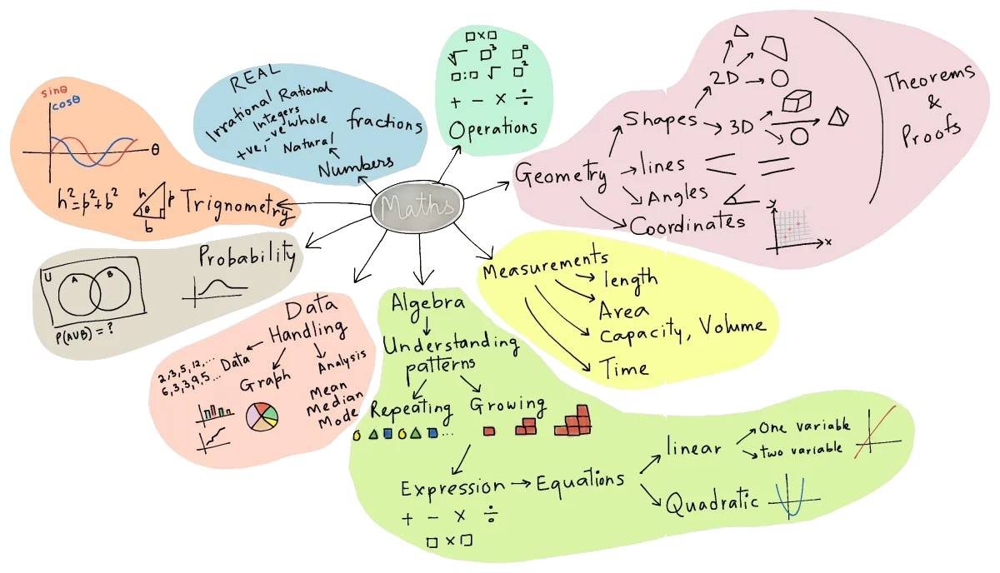
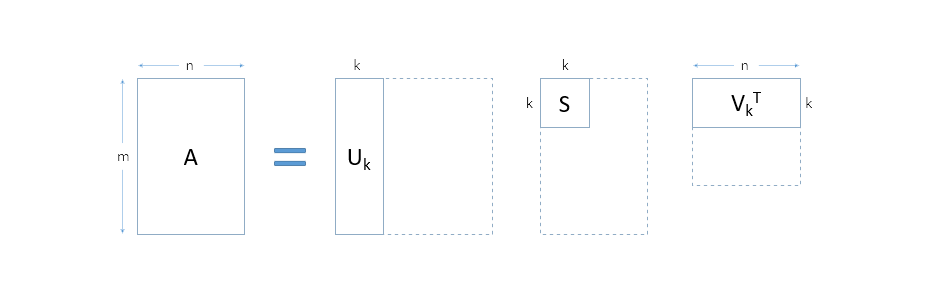

# Practical Mathematics 🌸

Mathematics in Machine Learning (ML) is mostly used for Optimization. Linear algebra to understand the objects being optimized (data and models are array), Calculus to understand how we optimize (with tiny changes) and Probability & Statistics to understand what we want to optimize. SVD (Single Value Decomposition) is a matrix version of refactoring.



[map of mathematics](./notes/map-of-mathematics.webp)

## Linear Algebra [[numpy](https://numpy.org/doc/stable/reference/routines.linalg.html), [code](https://github.com/vbartle/MML-Companion/blob/master/MML%20Python%2C%20Ch.02%20Linear%20Algebra.ipynb)]

[ Systems of Linear Equations,  Matrices, Solving Systems of Linear Equations, Vector Spaces, Linear Independence, Basis and Rank, Linear Mappings, Affine Spaces ]

`Linear Algebra` : Algebra of arrays/ matrix. Some examples of matrix multiplication in action: [ Linear / Logistic Regression, {dot, scalar, inner} product, Discrete Fourier Transform, Convolutions, Principal Component Analysis (PCA), Feedforward pass and Backpropagation pass ]

This equation means that the element in the i-th row and j-th column of the product matrix XY is obtained by taking the dot product of the i-th row of matrix X and the j-th column of matrix Y. In other words, you sum the products of corresponding elements from these rows and columns.

#### Understanding Arrays as Linear Functions
In linear algebra, arrays (or matrices) represent linear transformations or functions. These functions are particularly well-suited to operations involving weighted sums. A linear function, represented by a matrix, maps vectors from one space to another while preserving vector addition and scalar multiplication.

#### The Kernel of a Linear Function
The kernel (or null space) of a linear function consists of all input vectors that are mapped to the zero vector by that function. Mathematically, if A is a matrix representing a linear function f, then the kernel of f is defined as:

$$ Ker(A)={x∣Ax=0} $$

#### Rank of a Linear Function
The rank of a linear function (or matrix) is a measure of the dimension of the image (or column space) of the matrix. It tells us the maximum number of linearly independent columns in the matrix. These columns span the range of the function, meaning any vector in the range can be expressed as a linear combination of these columns.

#### Rank and Non-Kernel Elements
The rank of a matrix answers a crucial question: How many linearly independent vectors (non-kernel elements) are required to span the entire range of the matrix? In other words, the rank gives us the number of independent directions in which the linear function can map input vectors. Knowing this allows us to understand the full capacity of the transformation described by the matrix.

By comprehending these concepts, we can better appreciate the structure and behavior of linear transformations in various mathematical and practical applications.

🌸 Arrays represent linear functions. Linear functions really plays nice with weighted sum. Anything that is sent to 0 ( == 0 ) is called the Kernel of that function. These weighted sums define the rank of the function. We can make new non-kernel elements by making weighted sums of known non-kernel elements. Rank answers the question: how many non kernel elements do I need to know in order to make every element that's not in the kernel ?s

`Single Value Decomposition (SVD)`: Change internals of matrix without changing the output. Matrix Factorization: At its core, SVD decomposes a matrix into three separate matrices, representing the singular values, left singular vectors, and right singular vectors. This factorization helps in representing complex data structures in a simpler, more interpretable form. In ML, this is particularly useful when dealing with high-dimensional data.

<center></center>

Refactoring : Eigen Decomposition, Low rank approximation, SVD

### Matrix Decompositions : [[code](https://people.duke.edu/~ccc14/sta-663-2016/07_LinearAlgebra2.html), [code_2](https://github.com/vbartle/MML-Companion/blob/master/MML%20Python%2C%20Ch.04%20Matrix%20Decompositions.ipynb)]

[  Determinant and Trace,  Eigenvalues and Eigenvectors, Cholesky Decomposition, Eigendecomposition and Diagonalization, Singular Value Decomposition, Matrix Approximation, Matrix Phylogeny ]


```py
matrix = np.array([[1, 2], [3, 4], [5, 6]])  # 3 x 2 matrix
vector = np.array([7, 8])  # length 2 vector

print(matrix @ vector)  # multiply multiplication results in length 3 vector
print('Dimension and shape of matrix : ',matrix.ndim, ' and ', matrix.shape)
```
The transpose of a matrix `M` is written in numpy as `M.T`.

```py
a = 4
b = 0
 
# using assert to check for 0
print("The value of a / b is : ")
assert b != 0
print(a / b)

set_second_to_zero = np.array([[1, 0], [0, 0]])
vector = [10, 1]
assert (set_second_to_zero @ vector)[1] == 0
```

Matrix multiplication functions:

```py
def their_pipeline(v):
    after_W = np.matmul(W, v)
    after_X = np.matmul(X, after_W)
    after_Y = Y @ after_X
    after_Z = Z @ after_Y
    return after_Z
```
Parallelization in Linear Algebra - Concatenation :

```py
matrix = np.array([[1, 2], [3, 4], [5, 6], [7, 8]])
rows = [row for row in matrix]  # split the matrix into 4 rows with shape (2, 1)

vector = [3, 5]
print(matrix @ vector, [row @ vector for row in rows])
np.allclose(matrix @ vector,
            np.hstack([row @ vector for row in rows]))

arrays = [np.array([[1, 2], [3, 4]]), np.array([[5, 6], [7, 8]])]
print(arrays)

print(np.concatenate(arrays))
```

`numpy.allclose()` function is used to find if two arrays are element-wise equal within a tolerance and the `numpy.hstack()` function is used to stack arrays in sequence horizontally. More on linear algebra [here](https://github.com/wandb/edu/blob/main/math-for-ml/01_linearalgebra/extras.ipynb).

## Analytic Geometry [[code](https://github.com/vbartle/MML-Companion/blob/master/MML%20Python%2C%20Ch.03%20Analytic%20Geometry.ipynb)]

[ Norms, Inner Products, Lengths and Distances, Angles and Orthogonality, Orthonormal Basis, Orthogonal Complement, Inner Product of Functions, Orthogonal Projections, Rotations ]


### Multiple View Geometry [[notes](./mvgeometry.MD)]

## Vector Calculus [[code](https://github.com/vbartle/MML-Companion/blob/master/MML%20Python%2C%20Ch.05%20Vector%20Calculus.ipynb)]

[ Differentiation of Univariate Functions, Partial Differentiation and Gradients, Gradients of Vector-Valued Functions, Gradients of Matrices, Useful Identities for Computing Gradients, Backpropagation and Automatic Differentiation, Higher-Order Derivatives, Linearization and Multivariate Taylor Series ]

Calculus is approximation with linear maps and helps us incrementally optimize.The derivative is the ratio between change in output and change in input.


$$ f^{'}(x) \lim_{ε \to 0} \dfrac{f(x)+ε}{ε}$$

We make the change in input smaller.

Fréchet Derivative: If the change in the value of the output at a point ε away is 

$$ f(x+ε) = f(x) + f^{'}(x)ε + o(ε) $$

some function of x times ε, plus something smaller, we call that function the derivative. The function we are trying to approximate is linear and can be represented as arrays.

$$ f(x+ε) = f(x) + <\nabla f(x), ε> + o(||ε||) $$

Gradient Descent:

$$ x \longleftarrow x - \eta \nabla f(x) $$

```py
f_x = x
g_x = 2x^2

# this prints the limit
print(sympy.limit(f_x / g_x, x, 0))
```

[sympy](https://www.sympy.org/en/index.html), a Python library for doing symbolic math (limits, integrals, algebra, and more!)

More on Calculus in [notebook 1](https://github.com/wandb/edu/blob/main/math-for-ml/02_calculus/extras.ipynb) and [notebook 2](https://colab.research.google.com/github/ageron/handson-ml2/blob/master/math_differential_calculus.ipynb). Blog : [Calculus on Computational Graphs: Backpropagation](https://colah.github.io/posts/2015-08-Backprop/), [Calculus in SymPy](http://prob140.org/sp17/textbook/ch17/Calculus_in_SymPy.html).


## Probability and Distributions [[code](https://github.com/vbartle/MML-Companion/blob/master/MML%20Python%2C%20Ch.06%20Probability%20and%20Distributions.ipynb)]

[ Construction of a Probability Space, Discrete and Continuous Probabilities, Sum Rule, Product Rule, and Bayes’ Theorem, Summary Statistics and Independence, Gaussian Distribution, Conjugacy and the Exponential Family, Change of Variables/Inverse Transform ]

```py
import numpy as np

true_mu = -1.; true_sigma = 0.5; N = 20;
data = true_sigma * np.random.standard_normal(size=N) + true_mu
```

#### Probability Mass Function (PMF):

A PMF is used to describe the probability distribution of a discrete random variable. It assigns a probability to each possible outcome or value that the random variable can take.

Mathematically, for a discrete random variable X, the PMF is defined as:

$$ P(X = x) $$

Where x is a specific value that X can take, and P(X=x) is the probability of X taking that value.
In Python, we can create a PMF using a dictionary to represent the mapping of values to their probabilities.

```py
# Example PMF for a six-sided die
pmf_die = {1: 1/6, 2: 1/6, 3: 1/6, 4: 1/6, 5: 1/6, 6: 1/6}

# Probability of getting a 3 when rolling the die
probability_3 = pmf_die[3]

```

#### Probability Density Function (PDF):

A PDF is used to describe the probability distribution of a continuous random variable. Unlike a PMF, which assigns probabilities to discrete values, a PDF assigns probabilities to intervals or ranges of values.

Mathematically, for a continuous random variable X, the PDF is represented as a function f(x) such that:

$$ P(a \leq X \leq b) = \int_a^b f(x)dx $$

```python

import numpy as np
from scipy.stats import norm

# Example PDF for a standard normal distribution
mean = 0
std_dev = 1
pdf = norm.pdf(x, loc=mean, scale=std_dev)

# Probability of X falling in the interval [-1, 1]
probability_interval = norm.cdf(1, loc=mean, scale=std_dev) - norm.cdf(-1, loc=mean, scale=std_dev)
```

<table style="overflow:auto;">
<tr>
<th>Surprise / Entropy</th>
<th>Softmax</th>
</tr>

<tr>
<td>

While the probability captures the chance that an event occurs, the negative log probability, or "surprise", captures how unexpected an event is -- larger values mean it is more unexpected. Entropy measures the uncertainty or surprise associated with a probability distribution. Higher entropy values indicate more uncertainty or surprise.

Given the probability mass function (pmf), we can always compute the suprise by taking the negative logarithm:

```python

import scipy.stats as stats
import numpy as np

# Example probability distribution (a fair six-sided die)
probabilities = np.array([1/6, 1/6, 1/6, 1/6, 1/6, 1/6])

# Calculate entropy
entropy = stats.entropy(probabilities, base=2)
print("Entropy:", entropy)
```

</td>
<td>

Softmax is a mathematical function often used in machine learning and deep learning to convert a vector of real numbers into a probability distribution. It takes an input vector and normalizes it to produce a set of values between 0 and 1 that sum up to 1. The Softmax function is commonly used for multi-class classification problems to determine the probabilities of each class.


```python

import numpy as np

def softmax(x):
    e_x = np.exp(x - np.max(x))  # Subtracting the maximum value for numerical stability
    return e_x / e_x.sum(axis=0)
```


</td>
</tr>
</table>

$$ surprise(p, i) = -log(p_i) $$

$$ \text{softmax}(x)_i = \frac{e^{x_i}}{\sum_{j}e^{x_j}} $$


<br/>

<table style="overflow:auto;">
<tr>
<th>Entropy and Cross-Entropy</th>
<th>The KL-Divergence</th>
</tr>

<tr>
<td>

This is the same as the expected value of the surprise -- if we were to draw a large number of samples of a random variable with p as its pmf, calculate the surprise function on each, and then take the average, it would be close to the entropy.

If we draw samples according to the distribution p, but calculate the surprise using the distribution q, then the average surprise will not be the entropy. Instead, it will be the cross-entropy -- the entropy from mixing probability and surprise across distributions.

It measures the dissimilarity between the predicted probability distribution and the true (target) probability distribution. In the context of binary classification, the cross-entropy loss is often referred to as "binary cross-entropy," while for multi-class classification, it's called "categorical cross-entropy."

```python

import numpy as np

def binary_cross_entropy(y_true, y_pred):
    epsilon = 1e-15  # Small constant to avoid log(0)
    y_pred = np.clip(y_pred, epsilon, 1 - epsilon)  # Clip to avoid invalid log values
    return - (y_true * np.log(y_pred) + (1 - y_true) * np.log(1 - y_pred))

def categorical_cross_entropy(y_true, y_pred):
    epsilon = 1e-15  # Small constant to avoid log(0)
    y_pred = np.clip(y_pred, epsilon, 1 - epsilon)  # Clip to avoid invalid log values
    return - np.sum(y_true * np.log(y_pred), axis=-1)
```


</td>
<td>

KL divergence measures the difference between two probability distributions. It quantifies how one distribution differs from another, in terms of surprise or information.

```python
# Example probability distributions (P and Q)
P = np.array([0.3, 0.5, 0.2])
Q = np.array([0.2, 0.6, 0.2])

# Calculate KL divergence from Q to P
kl_divergence = stats.entropy(P, Q, base=2)
print("KL Divergence:", kl_divergence)
```

The cross-entropy gives us one way to measure how different two probability mass functions are -- almost like a notion of distance between two pmfs.

But the distance from a point to itself should be 0, while crossentropy(p, p) == entropy(p)

So instead of using the cross-entropy, it is sometimes convenient to use a different quantity to measure the difference between two probability distributions.


</td>
</tr>

</table>

$$ entropy(p) = \sum_{i} p_i . - log(p_i) $$
$$ crossentropy(p, q) = \sum_{i} p_i . - log(q_i) $$

$$ divergence(p, q) = \sum_{i} p_i . -log(\frac{q_i}{p_i}) $$


and we can say:

$$ divergence(p, q) = crossentropy(p, q) - entropy(p) $$


#### Minimizing the Surprise with Gradient Descent - The Gaussian Distribution and its Surprise Function :

Cross Entropy is the average surprise using the pmf q on samples from the pmf p.

But cross entropies and surprises don't always appear directly in the loss function. For example, if the variable we are predicting has a pdf instead of a pmf, then we'd need to work with functions instead of arrays, which is much tricker. Even in that case, the loss function is still usually derived from a surprise.

The Gaussian, or normal, distribution has the following probability density function:

$$ p(x;  μ) = \frac{1}{\sqrt{Z}}.e^{ - \frac{1}{2} (x- μ)^2 } $$

where 
 (pronounced "mew") is the mean of the distribution and Z = 2π.This constant ensures that the distribution integrates to 1.

 The surprise function in the context of the Gaussian distribution typically refers to the likelihood or probability of observing a specific value or range of values from the distribution.

```python
import numpy as np
import scipy.stats as stats

# Parameters of the Gaussian distribution (mean and standard deviation)
mean = 0
std_dev = 1

# Value you want to calculate the surprise for
x = 1.5

# Calculate the PDF (probability density function) at the given value
pdf_value = stats.norm.pdf(x, loc=mean, scale=std_dev)

# Alternatively, you can calculate the cumulative distribution function (CDF)
# to find the probability of the value being less than or equal to x
cdf_value = stats.norm.cdf(x, loc=mean, scale=std_dev)

# Calculate the "surprise" or likelihood
surprise = 1 / pdf_value  # Inverse of PDF value

print("PDF at x:", pdf_value)
print("CDF at x:", cdf_value)
print("Surprise at x:", surprise)
```

More on Probability and Statistics in [this](https://github.com/wandb/edu/blob/main/math-for-ml/03_probability/extras.ipynb) notebook.

### When Model Meet Data :

[ Data, Models, and Learning; Empirical Risk Minimization, Parameter Estimation, Probabilistic Modeling and Inference, Directed Graphical Models ]

### Linear Regression :

[ Problem Formulation, Parameter Estimation, Bayesian Linear Regression, Maximum Likelihood as Orthogonal Projection ] ([notebook.ipynb](./code/linear_regression_solution.ipynb))

### Dimensionality Reduction with Principal Component Analysis :

[ Problem Setting, Maximum Variance Perspective, Projection Perspective, Eigenvector Computation and Low-Rank Approximations, PCA in High Dimensions, Key Steps of PCA in Practice ([notebook.ipynb](./code/pca_solution.ipynb)), Latent Variable Perspective ]

### Dimensionality Estimation with Gaussian Mixture Models :

[ Gaussian Mixture Model ([notebook.ipynb](./code/gmm_solution.ipynb)), Parameter Learning via Maximum Likelihood, EM Algorithm, Latent-Variable Perspective ]

### Classification with Support Vector Machines :

[ Separating Hyperplanes, Primal Support Vector Machine, Dual Support Vector Machine, Kernels 388, Numerical Solution ]

## Continuous Optimization [[code](https://github.com/vbartle/MML-Companion/blob/master/MML%20Python%2C%20Ch.07%20Continuous%20Optimization.ipynb)]