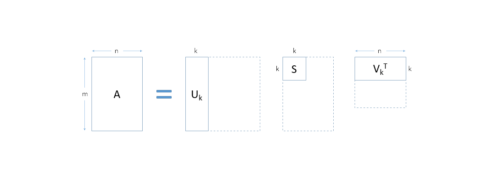

# Practical Mathematics

Mathematics in Machine Learning (ML) is mostly used for Optimization. Linear algebra to understand the objects being optimized (data and models are array), Calculus to understand how we optimize (with tiny changes) and Probability & Statistics to to understand what we want to optimize. SVD (Single Value Decomposition) is a matrix version of refactoring.


## Linear Algebra

[ Systems of Linear Equations,  Matrices, Solving Systems of Linear Equations, Vector Spaces, Linear Independence, Basis and Rank, Linear Mappings, Affine Spaces ]

Linear Algebra : Algebra of arrays/ matrix. Some examples of matrix multiplication in action:
- Linear / Logistic Regression
- {dot, scalar, inner} product
- Discrete Fourier Transform
- Comvolutions
- Principal Component Analysis (PCA)


$$ matmul(X, Y)_{i,j} = \sum_{i}{X_{i,r} Y_{r,j}} = XY_{i,j} $$

Arrays represent linear functions. Linear functions really plays nice with weighted sum. Anything that is sent to 0 ( == 0 ) is called the Kernel of that function. These weighted sums define the rank of the function. We can make new non-kernel elements by making weighted sums of known non-kernel elements. Rank answers the question: how many non kernel elements do I need to know in order to make every element that's not in the kernel ?

Single Value Decomposition (SVD): Change internals of matrix without changing the output. Matrix Factorization: At its core, SVD decomposes a matrix into three separate matrices, representing the singular values, left singular vectors, and right singular vectors. This factorization helps in representing complex data structures in a simpler, more interpretable form. In ML, this is particularly useful when dealing with high-dimensional data.



Refactoring : Eigen Decomposition, Low rank approximation, SVD

### Matrix Decompositions

[  Determinant and Trace,  Eigenvalues and Eigenvectors, Cholesky Decomposition, Eigendecomposition and Diagonalization, Singular Value Decomposition, Matrix Approximation, Matrix Phylogeny ]


```python
def square(x: float) -> float:
    return x ** 2
```

functions expects input of type float and returns float.

```py
matrix = np.array([[1, 2], [3, 4], [5, 6]])  # 3 x 2 matrix
vector = np.array([7, 8])  # length 2 vector

print(matrix @ vector)  # multiply multiplication results in length 3 vector

print('Dimension and shape of matrix : ',matrix.ndim, ' and ', matrix.shape)

```
The transpose of a matrix `M` is written in numpy as `M.T`.

```py

a = 4
b = 0
 
# using assert to check for 0
print("The value of a / b is : ")
assert b != 0
print(a / b)


set_second_to_zero = np.array([[1, 0],
                               [0, 0]])
vector = [10, 1]
assert (set_second_to_zero @ vector)[1] == 0
```

Matrix functions:

```py
def their_pipeline(v):
    after_W = np.matmul(W, v)
    after_X = np.matmul(X, after_W)
    after_Y = Y @ after_X
    after_Z = Z @ after_Y
    return after_Z
```
Parallelization in Linear Algebra: Concatenation :

```py
matrix = np.array([[1, 2], [3, 4], [5, 6], [7, 8]])
rows = [row for row in matrix]  # split the matrix into 4 rows with shape (2, 1)

vector = [3, 5]
print(matrix @ vector, [row @ vector for row in rows])
np.allclose(matrix @ vector,
            np.hstack([row @ vector for row in rows]))


arrays = [np.array([[1, 2], [3, 4]]), np.array([[5, 6], [7, 8]])]
print(arrays)

print(np.concatenate(arrays))

```

`numpy.allclose()` function is used to find if two arrays are element-wise equal within a tolerance and the `numpy.hstack()` function is used to stack arrays in sequence horizontally 

## Analytic Geometry

[ Norms, Inner Products, Lengths and Distances, Angles and Orthogonality, Orthonormal Basis, Orthogonal Complement, Inner Product of Functions, Orthogonal Projections, Rotations ]


## Multiple View Geometry [[notes](./mvgeometry.MD)]

## Vector Calculus

[ Differentiation of Univariate Functions, Partial Differentiation and Gradients, Gradients of Vector-Valued Functions, Gradients of Matrices, Useful Identities for Computing Gradients, Backpropagation and Automatic Differentiation, Higher-Order Derivatives, Linearization and Multivariate Taylor Series ]

## Probability and Distributions

[ Construction of a Probability Space, Discrete and Continuous Probabilities, Sum Rule, Product Rule, and Bayes’ Theorem, Summary Statistics and Independence, Gaussian Distribution, Conjugacy and the Exponential Family, Change of Variables/Inverse Transform ]

## When Model Meet Data

[ Data, Models, and Learning; Empirical Risk Minimization, Parameter Estimation, Probabilistic Modeling and Inference, Directed Graphical Models ]

## Linear Regression

[ Problem Formulation, Parameter Estimation, Bayesian Linear Regression, Maximum Likelihood as Orthogonal Projection ] ([notebook.ipynb](./code/linear_regression_solution.ipynb))

## Dimensionality Reduction with Principal Component Analysis

[ Problem Setting, Maximum Variance Perspective, Projection Perspective, Eigenvector Computation and Low-Rank Approximations, PCA in High Dimensions, Key Steps of PCA in Practice ([notebook.ipynb](./code/pca_solution.ipynb)), Latent Variable Perspective ]

## Dimensionality Estimation with Gaussian Mixture Models

[ Gaussian Mixture Model ([notebook.ipynb](./code/gmm_solution.ipynb)), Parameter Learning via Maximum Likelihood, EM Algorithm, Latent-Variable Perspective ]

## Classification with Support Vector Machines

[ Separating Hyperplanes, Primal Support Vector Machine, Dual Support Vector Machine, Kernels 388, Numerical Solution ]